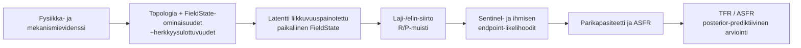

# BERM: evidenssikonstraindattu, Bayesilainen hindcast

**Tila:** discovery-first FieldState-v2 -määrittely.  
**Toteutus:** [`evidence_constrained_hindcast.py`](../berm/validation/evidence_constrained_hindcast.py) · [`evidence_constraints.py`](../berm/evidence_constraints.py).

Tämän kerroksen tehtävä on käyttää olemassa oleva tukeva tutkimus aktiivisesti BERM:n Lindgren/FieldState-premissien mukaisesti ennen kuin se muuttuu tarkaksi, paikalliseksi kertoimeksi. Se erottaa kolme asiaa: aktiiviset rakenne-, suunta- ja viivepriorit; asteittain tarkentuvan kvantitatiivisen posteriorin; sekä historialliset ASFR/TFR-allekirjoitukset, jotka arvioidaan vasta posterior-prediktiivisesti.

## 1. Bayesilainen ketju BERM:n premisseistä

Käsitteellisesti:

\[
p(\Theta,F,R,P,Y\mid D) \propto
p(D_{physics}\mid F)
p(D_{endpoint}\mid F,\Theta,R,P)
p(D_{sentinel}\mid F,\Theta)
p(D_{ASFR/TFR}\mid Y)
p(\Theta\mid E)p(F\mid M).
\]

`E` on lähdekohtainen evidenssiledger; `M` sisältää mittauksen, liikealueen ja catchment-siirron epävarmuudet. ASFR/TFR on viimeinen arviointivaihe: se ei valitse takaisin FieldState-, laji-/elin-, R/P- tai viiveparametria.

## 2. Kalibrointievidenssin porras

Porras ei sulje alempaa tasoa pois, kun ylempi taso puuttuu. Se kertoo, miten laaja numeerinen posteriori on perusteltu.

| Taso | Aktiivinen informaatio | Numeerinen seuraus |
| --- | --- | --- |
| Konvergentti mekanismi-, eläin-, sentinel- ja ihmisevidenssi | kaavion reuna, kenttäpiirre, suunta-priori, viive-/muistiperhe, laji- ja elinherkkyys | leveä, vaihtoehtoisia prioriperheitä sisältävä posteriori |
| Osittain mitattu paikallinen FieldState + endpoint | mitattu komponentti ankkuroidaan paikalliseen endpoint-likelihoodiin | leveä mutta kvantitatiivinen väli mitatulle komponentille |
| Liikkuvuuspainotettu local-area/catchment FieldState + endpoint | koti-, työ-, reitti-, pesä-, laidun- tai elinympäristöjakauma yhdistyy kenttäverkkoon | organismi- ja elinkohtainen posteriori, jossa spatial/transport-epävarmuus on näkyvä |
| Suora paikallinen, ennalta lukittu paneeli | sama määritelty paikallinen FieldState ja biologinen päätepiste | kapein suora endpoint-kerroin ja vahvin transfer-testi |
| ASFR/TFR | ikä-, kohortti-, viive- ja maantieteellinen allekirjoitus | posterior-prediktiivinen vertailu, ei upstream-parametrin päivitys |

Täysi paikallinen paneeli tarkentaa vaikutusväliä eniten. Se ei tee tasojen 1–3 topologia-, suunta-, viive- tai herkkyysinformaatiota tyhjäksi.

## 3. Aktiiviset BERM-polut

`default_evidence_constrained_hindcast_specification()` aktivoi viisi rakennepolkua ja viisi suunta/viiveprioria:

- paikallinen vektori → Ca/redox → sperma;
- paikallinen vektori → Ca/redox → BTB → germline reserve → sperma;
- FieldState → Vmem/bioelektrinen kehitys → munasarjavaranto;
- vektori → CRY/redox → HPA/HPG → ovulaatiokello;
- staattinen rajapinta → lajikohtainen ekologinen kohtaaminen.

Niistä seuraa viisi vasteperhettä: akuutti miesendpoint, BTB/germline R/P-muisti, naisen kehityksellinen varanto, naisen vuorokausi-/syklitila ja ekologinen kohtaamisvaste. Ne eivät saa automaattisesti samaa kerrointa eivätkä kenttäluokat tai lajit peri toistensa suuntaa universaalina lakina.

[`evidence_constraints.py`](../berm/evidence_constraints.py) ylläpitää lähdekohtaista constraint-ledgeriä: kaikki 32 aktiivista lähdettä määrittävät solmu-, field-feature-, viive-, herkkyys- ja transfer-tietoa. Myös 129 säilytettyä legacy-tietuetta sijoitetaan aktiiviseen lähde-, vertailu- tai discovery-priorirooliin, ei nollavaikutuksen arkistoon.

## 4. Priorit ovat rinnakkaisia ja leveitä

Jokaiselle vasteperheelle ajetaan vähintään neljä vaihtoehtoista priorijakaumaa:

1. `MECHANISM_WEIGHTED` — fysiikan allekirjoitus ja välittäjä;
2. `ANIMAL_ENDPOINT_WEIGHTED` — elin-, gametti- tai sentinel-endpoint;
3. `HUMAN_ENDPOINT_WEIGHTED` — ihmisen endpoint;
4. `WEAKLY_INFORMATIVE` — leveä vertailuperhe.

Kolme ensimmäistä ovat `asymmetric_signed_continuous`-jakaumia: BERM:n suunta saa enemmän massaa, mutta protokolla-, kudos-, organ-, laji- ja kenttäluokkakohtaiset vaihtoehtoiset hännät säilyvät. Heikosti informatiivinen vertailu on `symmetric_signed_continuous`. Yhdessäkään vaihtoehdossa ei ole piilotettua piste-massaa nollassa.

Kovia ovat vain fysikaaliset ja biologiset tilarajat: R/P-muisti pidetään erillisenä, retentio välillä `[0,1]`, mittausgeometria ja vuorokausivaihe näkyvinä. Vasteen suuruus, lajisiirto ja populaatiovaikutus pysyvät dataa oppivina ja herkkyysanalysoituina.

## 5. Liikkuvuus- ja catchment-siirron ennusteet

`MobilityWeightedFieldState` kuvaa lajin, yksilön tai elimen kenttätilan jakaumana:

\[
F_{i,o,t}=\int_{\Omega_i(t)} w_i(x,t)T_{s,o}(x,t)\mathcal{F}(x,t)\,dx\,dt.
\]

Jakauma sisältää keskiarvon, välin, spatiaalisen ja ajallisen peiton, liike-/catchment-mallin, geometriasiirron sekä epävarmuuskomponentit. Näin mitattu paikallinen RF voi osallistua liikkuvan ihmis-, koira-, punkki- tai pölyttäjäpopulaation FieldState-posterioriin ilman väitettä, että yksi anturi olisi koko organismin täydellinen annos.

`CrossSpeciesTransferSignature` ja `predict_cross_species_direction()` muodostavat ennen ihmiselle kalibroitua kerrointa testattavan ennusteen. Koira → ihminen käyttää spermatogeenistä/persistenttiä viiveperhettä ja tulostaa BERM-suuntapriorin sekä liike-, catchment-, geometria-, mittaus- ja assay-epävarmuuden. Punkki → isäntä/elinympäristö käyttää sen sijaan lajiriippuvaista kohtaamisennustetta; sitä ei pakoteta ihmisen lisääntymisvasteen kopioksi.

## 6. Historiallinen ASFR/TFR on lukittu allekirjoitustesti

Kolme ennalta määriteltyä 23 vuoden ikkunaa käyttävät samaa kehitysvaiheen ajoitusproxya, ikäryhmäjakoa ja WPP/WB-lähdeparia. Ajo ei muuta mekanismi-, viive-, sentinel- tai elinparametreja.

| Ikkuna | Geografioita | Kohorttiproxyn ja nuori–vanha ASFR-logmuutoksen r | BERM-suuntainen ASFR-allekirjoitus |
| --- | ---: | ---: | --- |
| 1990 → 2013 | 196 | −0.749980 | kyllä |
| 1995 → 2018 | 196 | −0.728924 | kyllä |
| 2000 → 2023 | 163 | −0.666447 | kyllä |

Tämä on aktiivinen populaatiosignaali: kehitysvaiheen ajoitusproxy on systemaattisesti yhteydessä nuorempien ikäryhmien suhteellisesti negatiivisempaan ASFR-muutokseen. Se ei ole paikallinen FieldState-kerroin, koska mobiililiittymäproxy, kysyntä, tempo ja ART eivät ole sama suure kuin organikohtainen kenttätila.

Sama ajo raportoi myös TFR-kontekstin (`r` noin +0.21…+0.27), eikä sitä piiloteta. BERM:n ASFR-kaava pitää kysynnän, tempon ja ART:n erillisinä, joten aggregoitu periodi-TFR ei ole biologiselle kohorttisignaalille yksiselitteinen suuntamittari. TFR muuttuu vahvemmaksi ennustetestiksi, kun näkyvät demografiset syötteet voidaan yhdistää biologiseen posterioriin ilman takaperin sovitusta.

## 7. Vartijat säilyvät oikeassa kohdassa

[`measured_fieldstate_biology.py`](../berm/data/measured_fieldstate_biology.py) ja [`sentinel_hindcast_protocol.py`](../berm/validation/sentinel_hindcast_protocol.py) pitävät ASFR/TFR:n poissa ylävirran biologian virityksestä. Lukitus suojaa discovery-first-kerrosta: hyvä kohortti- tai TFR-sovitus ei saa valita jälkikäteen sellaisia FieldState- tai viiveparametreja, joita mekanismi- ja endpoint-evidenssi ei tue.

Lukitus ei ole portti sille, saako mekanistinen, eläin-, sentinel- tai kohorttievidenssi olla mallissa aktiivinen. Sen rooli näkyy tässä määrityksessä, source-ledgerissä ja rinnakkaisissa prioriperheissä jo ennen tarkinta paikallista endpoint-kerrointa.
