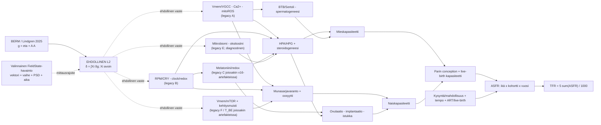

# FieldState v2 -mittausrajapinta ja ehdollinen ASFR-laskenta

**Tila:** historiallisella tiedostonimellä säilytetty integraatio-ohje. FieldState on BERM:n valinnainen mittaus-, havainto- ja estimointisivuhaara, ei kanoninen malli, mallin alias eikä kausaalinen juuri.

**Mittausmäärittely:** `fieldstate` / `v2`.

**Ehdollinen laskentareitti:** `berm-conditional-asfr-v1`.

**Ehdollinen L2-tila:** BERM johtaa formaalin metriikka–havaittava-vasteoperaattorin minimaalisen materiakytkennän ja vastefunktion ehdoilla. Fysikaalinen mittakaava, gauge-resepti, kudosytimet ja ihmispäätepisteiden kalibraatio ovat avoimia.

BERM on varsinainen selitys-, johtamis- ja ennustemalli. Tämä ohje kuvaa, miten FieldState-havainto voidaan tulevaisuudessa tuoda BERM:n ehdolliselle mittausrajalle ja miten erikseen annetut biologiset paritilat voidaan viedä ehdollisesti ASFR:ään ja TFR:ään. Se ei johda biologisia tiloja FieldStatesta eikä sisällä kudosvasteen kalibrointia.

Käytännössä muutos on seuraava:

- aiempi `ambient + χ·personal` säilyy historiallisena ajoitusproxyna ja vertailureitin syötteenä;
- FieldState voi toimittaa elinpaikallisen mittauksen tai siirtoarvion avoimen L2-rajapinnan tarkasteluun, ei kansallisena EMF-annoksena eikä valmiina biologisena syötteenä;
- A–F/T-kirjainten alle kertyneet mekanismit säilytetään, mutta epäyhtenäiset kirjaimet ratkaistaan **lähdetiedoston mukaan** semanttisiin nimiin;
- biologinen näyttö tukee ensiksi omaa linkkiään (esim. `BTB → siittiötuotanto`), ei automaattisesti maakohtaista TFR-kerrointa;
- väestöpääte mallinnetaan edelleen `pari → ASFR → TFR`, jossa kysyntä, tempo ja ART ovat erillisiä selittäjiä.

FieldState v2 on tarkoituksellisesti BERM:n sivuhaara. Yhteinen arkkitehtuurisopimus estää mittaustietueen, legacy-proxyn, biologisen mekanismin ja ennustereitin sekoittamisen toisiinsa.

Evidenssin discovery-first- ja bayesilainen tulkintasääntö on
[`fieldstate-discovery-inference.md`](fieldstate-discovery-inference.md):
rakenne-, suunta-, viive- ja lajikohtainen evidenssi on aktiivinen mallisyöte;
täysi paikallinen paneeli kaventaa vaikutusväliä, mutta ei ole edellytys
signaalin löytämiselle tai lajienvälisten FieldState-ennusteiden tekemiselle.
Koko v2-reitin vartijoiden ja tulkintojen läpikäynti on
[`evidence-inference-audit.md`](evidence-inference-audit.md)-auditissa.

## 1. BERM:n ja mittaushaaran rajapinta

Uudessa reitissä historialliset A–F/T-kirjaimet ovat vain **lähdekohtaisia** legacy-aliaksia. Tutkimus ja parametrit kiinnitetään semanttisiin solmuihin, esimerkiksi `BARRIER_BTB`, `MELATONIN_REDOX`, `BIOELECTRIC_DEVELOPMENT`, `OVARIAN_RESERVE` ja `COUPLE_FECUNDABILITY`. Näin BBB:tä, BTB:tä ja biologista kehityskoodia ei sekoiteta toisiinsa.

Kanoninen solmurekisteri on [`berm/biology/causal_registry.py`](../berm/biology/causal_registry.py). Sen [`legacy_compat.py`](../berm/biology/legacy_compat.py)-adapteri vaatii aina artefaktin nimen ennen kuin se ratkaisee vanhan kirjaimen merkityksen:

| Legacy-artefakti | Vanha tunniste | Kanoninen tulkinta | Numeerinen tila |
|---|---|---|---|
| `berm.biology.pathways.v17` | `C` | `BARRIER_BBB` | Vanha laskenta säilyy; vain tulkinta on `LEGACY_DIAGNOSTIC`. |
| `berm.v16.intervention_catalogue` | `C` | `MELATONIN_REDOX` | Ei sekoitu BBB:hen eikä muutu ASFR-kertoimeksi. |
| `berm.biology.pathways.v17` | `F` | `BARRIER_BBB` | Vanha BBB-multiplieri ei laajene automaattisesti muihin esteisiin. |
| `berm.v16.intervention_catalogue` | `F` | `VMEM_MTOR` | Bioelektrinen/mTOR-haara säilyy omana mekanismina. |
| `berm.biology.pathways.v17` | `E` | `MICROBIOME_OT` | Säilyy diagnostiikkahaara; ei saa uusia TFR-painoja ilman omaa endpoint-kalibrointia. |
| v16-raportit | `epigenetic_factor` | `BIOELECTRIC_DEVELOPMENT` | Kehitysmuisti säilyy, mutta se ei peri vanhaa maaskalaariarvoa. |

Siksi pelkkä `C`, `F` tai `T` ei enää ratkea koodissa automaattisesti. Tämä on tarkoituksellinen vartija: se estää vanhan evidenssin liittämisen väärään biologiseen reittiin samalla, kun kaikki alkuperäiset laskelmat säilyvät muuttumattomina.

Koko aiempi 129-tietueinen bibliografia on säilytetty [`legacy-evidence-migration.md`](legacy-evidence-migration.md)-kuvatulla tietuekohtaisella siirtokerroksella. Se ei hävitä näyttöä, mutta erottaa jo aktiiviseen rekisteriin varmennetut lähteet, uudelleentulkintaa odottavat kandidaatit ja pelkän kontekstin.

## 2. FieldState säilyttää mittausrakenteen, ei ratkaise L2-kytkentää

FieldState-mittaushaaran elinkohtainen valintasuure on toteutettu muodossa

\[
\mathbf A_{\mathrm{selected},o}
=T_o\mathbf A_{\mathrm{ambient}}
+\chi\!\left(\left|T_o\mathbf A_{\mathrm{background}}\right|\right)
T_o\mathbf A_{\mathrm{personal}},
\qquad
\chi(a)=\frac{a}{\sqrt{1+a^2}}.
\]

Lisäksi säilytetään erillisinä, eikä hävitetä yhdeksi kansalliseksi keskiarvoksi:

\[
X_{\mathrm{geom},o}=2(T_o\mathbf A_{\mathrm{background}})\cdot(T_o\mathbf A_{\mathrm{personal}}),
\]

\[
X_{\mathrm{coherent},o}=X_{\mathrm{geom},o}\,c\cos(\phi),
\qquad
\Xi_o=\int PSD_{\mathrm{envelope/beat},o}(f)W_o(f)\,df.
\]

Tässä `T_o` on elin-, kudos-, asento-, etäisyys-, rakennus- ja polarisaatiogeometrian siirtofunktio; `c` ja `phi` ovat mitattu koherenssi ja suhteellinen vaihe; `W_o` on ennalta ilmoitettu reseptori-/solutilakohtainen vasteikkuna. Ne eivät ole automaattisesti TFR-kertoimia.

Toteutus: [`berm/physics/field_state.py`](../berm/physics/field_state.py).

### Kolme selkeää tietotasoa

| Tila | Mitä se tarkoittaa | Miten sitä saa käyttää |
|---|---|---|
| `LEGACY_TIMING_PROXY` | Nykyinen `ambient + chi(ambient) * personal` -erikoistapaus; esimerkiksi mobiililiittymät ajoittavat digitaalisen ympäristön leviämistä. | Kohortti- ja ajoitussignaalin tutkimiseen, ei paikalliseksi annokseksi. |
| `PARTIAL_FIELD_STATE` | Jokin fysikaalisen tilan osa on mitattu, mutta esimerkiksi PSD, B0, elinsiirto tai vuorokausikonteksti puuttuu. | Aktiiviseksi mitatuksi FieldState-komponentiksi, paikallisen/alueellisen likelihoodin sekä suunta-, siirto- ja lajikohtaisten posteriori-ennusteiden rakentamiseen; puuttuvat komponentit kannetaan epävarmuutena. Ei yksin väitä valmista elinannosta tai kapeaa endpoint-kerrointa. |
| `MEASUREMENT_READY_FIELD_STATE` | Dokumentoitu normalisointi, B0-vektori, elinsiirto, PSD, circadian-konteksti, vaihe/koherenssi ja mittausprovenienssi ovat läsnä. | Elinkohtaisen endpoint-mallin kalibrointiin, kun myös biologinen päätepiste on yhdistetty ennalta määritellysti. |

Tämä erottelu ratkaisee BERM:n keskeisen mittausongelman: kansallinen teknologian levinneisyys ei saa hiljaisesti muuttua kivesten, munasarjan tai hypotalamuksen paikalliseksi kenttätilaksi. Se ei kuitenkaan ratkaise seuraavaa askelta eli sitä, miten kenttätilasta johdettaisiin biologinen havaittava.

## 3. Elinkohtainen R/P-muisti ja biologinen kapasiteetti

Kenttävasteen nopea ja hidas osa mallinnetaan jokaiselle elimelle erikseen:

\[
R_{o,t}=r_oR_{o,t-1}+\Delta R_{o,t},
\qquad
P_{o,t}=p_oP_{o,t-1}+\Delta P_{o,t}.
\]

`R` on palautuva kuorma, `P` persistentti kuorma. Incrementit eivät synny FieldState-laskennasta: ulkoisen tutkimus- tai biologisen mallin on annettava kullekin elimelle incrementti, retentio, parameter-ID ja evidenssi-ID. Tämä mahdollistaa eri aikaskaalojen ehdollisen tarkastelun johtamatta niitä mittausmoduulista.

Kun elinendpointille on oma ennalta rekisteröity mapping, kuorma muutetaan kapasiteettitekijäksi näkyvällä muodolla

\[
F_o=f_{\min,o}+(1-f_{\min,o})
\exp[-(\beta_{R,o}R_o+\beta_{P,o}P_o)].
\]

`beta_R`, `beta_P` ja `f_min` on aina annettava yhdessä parameter- ja evidenssi-ID:n kanssa. Siksi mallissa ei ole piilotettua "FieldState -> TFR" -kulmakerrointa. BERM:n ehdollinen ketju alkaa ulkoisesti annetusta biologisesta incrementistä: vasta ehdotetun ja validoidun L2-operaattorin jälkeen mittaus voisi tuottaa incrementin, josta seuraisivat elinmuisti, elinendpointti ja parin kapasiteetti.

Toteutus: [`berm/biology/reproductive_state.py`](../berm/biology/reproductive_state.py) ja [`berm/stats/fieldstate_core.py`](../berm/stats/fieldstate_core.py).

### Mies

\[
\Phi_m=
F_{\mathrm{germline\ reserve}}
F_{\mathrm{BTB}}
F_{\mathrm{steroidogenesis}}
F_{\mathrm{sperm\ output}}
F_{\mathrm{sperm\ function}}
F_{\mathrm{sperm\ DNA}}.
\]

BTB on oma `BarrierState('BTB')`, ei BBB-multiplierin sivuvaikutus. Se muodostaa paikallisen Sertoli–tight-junction–spermatogeneesi-haaran, johon Local FieldState, ROS ja HPA/HPG voivat tulla eri reitteinä.

### Nainen

\[
\Phi_{f,\mathrm{conception}}=
F_{\mathrm{ovarian\ reserve}}
F_{\mathrm{oocyte\ redox}}
F_{\mathrm{ovulatory\ clock}},
\]

\[
L_f=F_{\mathrm{luteal/implantation}}F_{\mathrm{placental\ barrier}},
\qquad
\Phi_f=\Phi_{f,\mathrm{conception}}L_f.
\]

Naispuoli ei siis enää rajoitu legacy-reitin `CRY × melatonin × ovulation` -tekijään. Varanto, oosyyttien mitokondrio/redox, ovulaation kellotus ja implantaatio/istukka voidaan mitata ja kalibroida erikseen.

### Pari

\[
\Phi_{ij,t}^{\mathrm{couple}}
=\Phi_{m,i,t}\Phi_{f,j,t}^{\mathrm{conception}}
F_{\mathrm{shared\ household},ij,t}L_{f,j,t}.
\]

Väestötasolla laskin laskee annettujen paritilojen keskiarvon, ei `keskiarvomies × keskiarvonainen` -tuloa. Yhteinen kotiympäristö, paikallisgeometria ja biologinen varanto voidaan näin säilyttää eksplisiittisinä kovarianssilähteinä ilman että niiden vaikutus johdetaan FieldStatesta.

## 4. ASFR ensin, TFR vasta sen summana

\[
ASFR_{c,g,t}=ASFR_{c,g,t_0}^{\mathrm{ref}}
\times\frac{\Phi_{c,g,t}^{\mathrm{couple}}}{\Phi_{c,g,t_0}^{\mathrm{couple}}}
\times\frac{O_{c,g,t}}{O_{c,g,t_0}}
\times\frac{\tau_{c,g,t}}{\tau_{c,g,t_0}}
\times\frac{ART_{c,g,t}}{ART_{c,g,t_0}},
\]

\[
TFR_{c,t}=\frac{5}{1000}\sum_{g=15\text{–}19}^{45\text{–}49}ASFR_{c,g,t}.
\]

`O` = kysyntä ja mahdollisuus (parinmuodostus, lapsitoive, ehkäisy, talous, politiikka); `tau` = periodi-tempo; `ART` = ART:n ja muun hoidon live-birth-delivery. Ne ovat näkyviä erillisiä syötteitä, eivät biosignaalin piilomääritelmiä. Näin sama biologinen FieldState voi näkyä maassa ensiksi pidempänä yrittämisaikana, ART-kysyntänä tai parity progression -hävikkinä ennen kuin se näkyy TFR:ssä.

Toteutus: [`berm/outcomes/fieldstate_asfr.py`](../berm/outcomes/fieldstate_asfr.py).

Uuden reitin syötteenä on aina havaittu reference-ASFR ja sekä reference- että target-paritila. Se tuottaa joka ikäryhmälle biologisen, demand/opportunity-, tempo- ja ART-suhteen erikseen sekä summatun TFR:n. Siksi 2010-luvun nuoren ASFR:n nopeaa laskua ja myöhempää catch-upia voidaan käsitellä oikein ilman, että tempo tulkitaan automaattisesti biologiseksi kapasiteetiksi.

## 5. Tutkimusnäytön sijoitus malliin

Koneellisesti luettava rekisteri: [`data/evidence/fieldstate_causal_evidence.json`](../data/evidence/fieldstate_causal_evidence.json). Lataaja: [`berm/evidence_registry.py`](../berm/evidence_registry.py).

| Mallin osa | Vahva, solmuun kiinnitetty tutkimustuki | Mitä se lisää BERM:ään |
|---|---|---|
| Tausta-, kulma- ja vektoririippuvuus | Blackman 1985, [doi](https://doi.org/10.1002/bem.2250060402); Ritz 2004, [doi](https://doi.org/10.1038/nature02534); Usselman 2016, [doi](https://doi.org/10.1038/srep38543) | `B0`, kulma, elinsiirto ja ristitermejä ei voi hävittää pelkkään maakeskiarvoon. |
| Reseptoriorientaatio ja RPM/CRY | Majewska 2025, [doi](https://doi.org/10.1021/acschembio.4c00576); Sherrard 2018, [doi](https://doi.org/10.1371/journal.pbio.2006229) | `B_RPM_CRY` saa oman vektori-, kalvo- ja redox-tilansa eikä sitä pakoteta VGCC-skalaariksi. |
| Envelope/mHz ja mito-ROS | Zandieh 2025, [doi](https://doi.org/10.1038/s41598-025-87235-w) | `PSD_envelope` ja solu-/redox-tilakohtainen vasteikkuna ovat mitattavia ominaisuuksia. Lähteen 0.01–5 Hz / 0–100 mT rajaus säilytetään. |
| Vuorokausi/redox | Cao 2015, [doi](https://doi.org/10.3390/ijerph120202071) | FieldState tarvitsee ajan, valon ja yövaiheen; vuosikeskiarvo ei riitä B-haaran syötteeksi. |
| Miehen akuutti funktionaalinen päätepiste | De Iuliis 2009, [doi](https://doi.org/10.1371/journal.pone.0006446); Baldini et al. 2025, [doi](https://doi.org/10.3390/toxics13060510) | `A_VGCC_ROS → MALE_SPERM`: mitoROS, 8-OHdG, DNA ja motiliteetti ovat erillisiä mittareita; paikallisgeometria säilyy näkyvänä. |
| Paikallinen kives- ja BTB-haara | Yu 2020, [doi](https://doi.org/10.1016/j.scitotenv.2019.133860); Meena 2014, [doi](https://doi.org/10.3109/15368378.2013.781035) | `BARRIER_BTB` on oman R/P-muistin ja mieskapasiteetin komponentti. |
| Redox → tight junction | Lochhead 2010, [doi](https://doi.org/10.1038/jcbfm.2010.29); Chakraborty 2020, [doi](https://doi.org/10.1016/j.reprotox.2020.06.012) | BBB- ja BTB-haaroille yhteinen redox/tight-junction-logiikka, kuitenkin eri elimissä. |
| Naisen reservi, kello ja oosyytti | Ahmadi 2016, [doi](https://doi.org/10.19082/2168); Calis et al. 2021, [doi](https://doi.org/10.1080/15513815.2019.1692112); Yousefi et al. 2025, [doi](https://doi.org/10.1007/s43032-025-01880-0); Liu 2014, [doi](https://doi.org/10.1073/pnas.1209249111); He 2016, [doi](https://doi.org/10.3390/ijms17060939) | `OVARIAN_RESERVE`, `OOCYTE_REDOX`, `OVULATION_CLOCK` ja `IMPLANTATION` ovat eksplisiittisiä. |
| Review-tason konteksti | Cordelli et al. 2024, [doi](https://doi.org/10.1016/j.envint.2024.108509), 2025 korjaus, [doi](https://doi.org/10.1016/j.envint.2025.109449), sekä Naderi et al. 2026, [doi](https://doi.org/10.1016/j.reprotox.2026.109300) | Reviewt jäsentävät mieshaaran tutkimusohjelmaa ja osoittavat endpointtien heterogeenisyyden; niitä ei käytetä yksittäisenä TFR-kertoimena. |

Jokaisessa rekisteritietueessa on mukana tutkimusjärjestelmä, altistusluokka, solmu, suoruus, siirtoraja, rajoitteet ja kalibrointirooli. Siirtorajan näkyminen on olennaista: se vahvistaa mallin oikeaa solmua ilman että esimerkiksi soluviljelmä tai lintukompassi esitetään ihmisen TFR-ennusteena.

## 6. TFR-datan tulkinta BERM:ssä

BERM:n kohortti-premissi ennustaa, että kehitysvaiheessa enemmän digitaalisen kenttäympäristön ajoitusproxyä saanut kohortti poikkeaa myöhemmin nuorten ASFR-ryhmien suhteessa vanhempiin ryhmiin. Tämä on täsmällisempi ennuste kuin samanaikainen `mobiililiittymät -> TFR`-korrelaatio.

Toistettavassa 2000–2023 ajossa UN WPP 2024 ASFR- ja World Bank/ITU -liittymäsarjoilla:

- 54 BERM-maassa BERM:n nykyisillä kehityspainoilla nuoren (15–29) ja vanhemman (30–49) ryhmän kohorttiproxyn erotus korreloi nuori–vanha ASFR-logmuutoksen kanssa: `r = -0.640121`, `p = 1.8685e-7`; Spearman `rho = -0.649857`, `p = 1.0535e-7`.
- Kaikkien täydellisten maapaneelien ajossa `N = 163` ja `r = -0.66645`.
- Alue- ja tulorakenteen vaikutus on pidettävä näkyvänä; tämä on mallin premissin suuntainen kuvaileva kohorttisignaali, ei FieldState- tai biologinen kalibrointikerroin.

Toistettava, repo-integroitu laskenta on [`berm/validation/fieldstate_cohort_signature.py`](../berm/validation/fieldstate_cohort_signature.py). Sen tulos kiinnitetään evidenssirekisterin tietueeseen `WPP_WB_BERM_COHORT_ASFR_2026` nimenomaan `POPULATION_DESCRIPTIVE`-tasolla. Siirtymä oikeaan FieldState-testiin tapahtuu, kun `mobile` korvataan paikallisella/muistitetulla FieldState-paneelilla ja parikohtaisilla tai vähintään ikä-kohorttitasoisilla biomarkkereilla.

## 7. Käytännön data- ja kalibrointijärjestys

1. **Mittaa FieldState:** taustavektori/B0, ambient- ja henkilökohtaiset lähteet, PSD/verhokäyrä, kulma/vaihe/koherenssi, paikka/asento ja elinsiirto.
2. **Mittaa välitilat samaan indeksijoukkoon:** CRY/redox, Ca/mitoROS, BBB/BTB tight junction/efflux, sperm DNA/motiliteetti/konsentraatio, AMH/AFC/oosyytti- ja steroidogeeniset mittarit.
3. **Määritä elinkohtainen R/P-muisti:** pre-specifioi retentiot ja incrementtimalli; tallenna parameter- ja evidenssi-ID:t.
4. **Muodosta paritila:** säilytä yhteinen kotiympäristö ja partnerikorrelaatio yksilötasolla tai määritellyssä stratumissa.
5. **Kytke WPP/HFD-tyyppiseen ikäryhmädataan:** pidä reference-ASFR, kysyntä/mahdollisuus, tempo ja ART erillisinä syötteinä.
6. **Kalibroi vain train-jaksolla:** pidä target-ajan ASFR/TFR ulkopuolisena hindcastina. Kun sentinelliä käytetään ennakkoindikaattorina, lukitse myös sen FieldState → biologinen endpoint → ihmisbiologia -viive ennen demografisen outcome-ikkunan avaamista; koneellisesti pakotettu sopimus on [`sentinel-hindcast-protocol.md`](sentinel-hindcast-protocol.md). V2-tulos esitetään legacy-v17:n rinnalla, kunnes paikallisen FieldState-paneelin kattavuus on riittävä.

Näin BERM kasvaa selitysvoimaisemmaksi juuri siellä, missä sen omat premissit ovat erottavimmillaan: eri maiden saman teknologialeviämisen ei tarvitse tuottaa samaa biologista vaikutusta, koska FieldState, kehityshistoria, elin-, pari- ja demografiakerros ovat eri suureita.

## 8. Rajapinnat ja testit

- Fysiikka: [`berm/physics/field_state.py`](../berm/physics/field_state.py)
- Semanttinen kausaalikaavio: [`berm/biology/causal_registry.py`](../berm/biology/causal_registry.py)
- Organismi-, barrieri- ja paritila: [`berm/biology/reproductive_state.py`](../berm/biology/reproductive_state.py)
- Fysiikka → R/P -bridge: [`berm/stats/fieldstate_core.py`](../berm/stats/fieldstate_core.py)
- ASFR → TFR: [`berm/outcomes/fieldstate_asfr.py`](../berm/outcomes/fieldstate_asfr.py)
- Ehdollisen WPP-reference-laskennan yhteensopivuusfasadi: [`berm/model_fieldstate_asfr.py`](../berm/model_fieldstate_asfr.py)
- Sentinelli → ihmisbiologia → ASFR/TFR -lukitus: [`berm/validation/sentinel_hindcast_protocol.py`](../berm/validation/sentinel_hindcast_protocol.py)
- Kohortti–ASFR-timing-proxy: [`berm/validation/fieldstate_cohort_signature.py`](../berm/validation/fieldstate_cohort_signature.py)
- Tutkimusrekisteri: [`data/evidence/fieldstate_causal_evidence.json`](../data/evidence/fieldstate_causal_evidence.json)
- Testit: [`tests/test_field_state.py`](../tests/test_field_state.py), [`tests/test_fieldstate_asfr_v2.py`](../tests/test_fieldstate_asfr_v2.py), [`tests/test_fieldstate_evidence.py`](../tests/test_fieldstate_evidence.py), [`tests/test_fieldstate_cohort_signature.py`](../tests/test_fieldstate_cohort_signature.py)

Legacy-v16/v17 säilyy vertailureittinä. FieldState v2 ei julkaise ennusteita. Ehdollinen ASFR-laskin antaa tuloksen vain eksplisiittisistä ulkoisista biologisista ja demografisista syötteistä, eikä tulosta saa nimetä FieldState-kalibroiduksi ilman erillistä ratkaistua L2-operaattoria ja kalibrointia.
