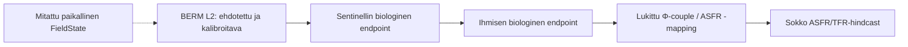

# BERM: ehdollisen sentinelli → ihmisbiologia → ASFR/TFR -ketjun hindcast-protokolla

Versio: `sentinel-hindcast-protocol-v1`
Tila: **rakenne- ja suuntaevidenssi aktiivinen; paikallinen numeerinen
FieldState→endpoint-kalibrointi odottaa matchattua paneelia**

Liittyy: [FieldState–ASFR v2](fieldstate-asfr-v2.md), [sentinellidatan
vaatimukset](sentinel-data-requirements.md), [data-aukkorekisteri](data-gap-register.md)
ja [ANFR:n mitattu RF-kerros](anfr-measured-rf-layer.md), sekä [lukittu mitattu
FieldState–biologia-paneeli](measured-fieldstate-biology-panel.md).

Tämä protokolla tekee seuraavan tutkimusvaiheen ennustavaksi BERM:n omien
premissien sisältä. Se ei hae FieldState-, muisti-, sentinelli- tai
viiveparametreja siitä, mikä sopii parhaiten jälkikäteen TFR-sarjaan. Ensin
lukitaan BERM:n ehdottama paikallinen mittaus → L2 → biologia -ketju ulkoisella
endpoint-datalla; ASFR/TFR on vasta ulkoinen, ajallisesti myöhempi arviointi.
FieldState määrittelee mittaustietueen eikä itse muodosta tai lukitse biologista
kytkentää.

## Parametrien tunnistettavuus

BERM:n ehdokasketjussa FieldState-skaala, elinsiirto `T_o`, biologinen
vastekertoimen `β_o` ja R/P-muisti voivat muuten korvata toisensa. Jokainen
`ParameterFamily` ilmoittaa siksi yhden mitatun tai ennalta kiinnitetyn
skaala-ankkurin, kohdesolmun, parametrit ja manifest-lukitut
upstream-kalibrointiaineistot.

- FieldState-mittaus: normalisointi, vektori-, vaihe- ja PSD-piirteet.
- Avoin L2 / elinsiirto: ulkoisesti spesifioitu ja endpoint-datalla kalibroitava `T_o`.
- R/P-muisti: palautuvan ja persistentin komponentin retentio sarjaendpointista.
- Sentinellivaste: laji- ja endpoint-kohtainen vaste mitattuun FieldStateen.
- Sentinelli → ihmisbiologia: biologinen muutos samassa paneelissa.
- Ihmisbiologia → conception/live birth: biomarkkeri, TTP, menetys ja kliininen endpoint.

Mikään näistä ei saa sovittaa ASFR/TFR:ään. `fertility_asfr_region_age_year`,
`fertility_tfr_region_year`, parity, kysyntä, maahanmuutto ja ART kuuluvat
vain erilliseen demografiseen perusmalliin tai lukituksen jälkeiseen arviointiin.

## Viiveen ja matchin säännöt

Jokainen `LeadLagRule` ilmoittaa ennen outcome-ikkunan avaamista sentinel- ja
ihmisendpointin, positiivisen minimi–maksimiviiveen, biologiset lähde-ID:t ja
sen, että kalibrointikohde on `HUMAN_BIOLOGICAL_ENDPOINT`. Sääntö lukitaan
ennen ASFR/TFR:n avaamista. Viivettä saa tarkentaa sarjallisella sperma-, BTB-,
AMH-, TTP- tai raskaudenmenetysendpointilla, ei TFR-käyrän sopivuudella.

Jokainen `GeoTemporalMatch` vaatii:

- jaetun `geography_id`:n FieldState-, sentinelli- ja ihmisbiomarkkeriaineistolle;
- saman ennalta ilmoitetun havaitun aikavälin;
- tason `EXACT_SITE`, `PREDEFINED_CATCHMENT` tai `SUBNATIONAL`;
- versionoidun spatiaalisen crosswalkin, aikaikkunasäännön ja endpoint-määritelmän;
- nimettyjen endpointille relevanttien sekoittaja-aineistojen joukon; sekä
- havaitut (ei proxy- tai skenaario-) rivit ja `MEASUREMENT_READY_FIELD_STATE`-tilan.

Tämä metatason `GeoTemporalMatch` ei yksin riitä numeeriseen kalibrointiin.
Sillä täytyy olla alla manifestijäädytetty `LockedMeasuredFieldStateBiologyPanel`,
joka dokumentoi yksittäisten FieldState-havaintojen, elinsiirron, biologisten
endpointien, aikaikkunoiden ja sekoittaja-aineistojen todellisen liitoksen.
`EXACT_SITE` on tarkin vaihtoehto; `MOBILITY_WEIGHTED_CATCHMENT` ja
`LOCAL_AREA_ESTIMATE` ovat yhtä lailla kelvollisia, kun niiden crosswalk,
liike-/aluekernel, ajallinen peitto ja epävarmuus on lukittu. Jälkimmäiset
tuottavat leveämmän, eivät nollaan pakotetun parametriarvion.

Kiinteän anturin ambientti `V/m` -sarja ei yksin täytä viimeistä ehtoa.
Country-year-aggregointi on myöhempi vaihe ja vaatii läpinäkyvän
näytekehikko-/väestöpainotuksen.

## Train → lock → holdout

1. **Upstream-kalibrointi:** käytä vain `calibration_end_year`iin päättyviä
   FieldState-, sentinelli-, ihmisbiomarkkeri- ja sekoittaja-aineistoja.
2. **Lock:** jäädytä data-vintagen SHA-256:t, lähderekisteri, yhtälöversio,
   skaala-ankkurit ja välit, lead–lag-säännöt, crosswalk, puuttuvuussääntö ja
   vertailumalli.
3. **Ajallinen hindcast:** `target_start_year` on aina originin jälkeen.
   Demografinen perusmalli saa käyttää vain originia edeltävää demografiaa,
   mutta ei päivittää upstream-biologisia parametreja.
4. **Maantieteellinen transport-holdout:** kokonaiset
   `geographic_holdout_ids` pidetään pois biologisesta parametrisovituksesta.
   Holdout-alueen TFR/ASFR ei ole residuaali eikä biologisen kertoimen korjaus.

Yksi hyväksyttävä ajo tuottaa erilliset eligibility reportin, parameter lockin,
as-of forecast ledgerin ja post-lock scorecardin. BERM- ja sentinellitön
perusmalli pisteytetään samoilla alue × ikä × vuosi -riveillä.

## Nykyinen kvantitatiivinen pullonkaula

Koneellinen vartija raportoi **kvantitatiivisen kalibroinnin odottavan**,
koska G-3, G-5, G-7, G-8 ja G-4 ovat auki: ANFR:n RF ei ole matchattu
biologiseen paneeliin; monialueinen sentinellipaneeli ja havaittu
ihmisbiomarkkerisarja puuttuvat; vastaava subnational ASFR/TFR-holdout puuttuu;
ja parity/tempo-erottelu on yhä tarpeen lopullisessa demografisessa
tulkinnassa. Tämä rajaa uuden kertoimen estimointia — se ei mitätöi jo
rekisteröityä FieldState-, mekanismi-, elin- tai kohorttievidenssiä, joka
asettaa mallille testattavia suunta- ja viive-ennusteita jo nyt.

Toteutus: [`berm.validation.sentinel_hindcast_protocol`](../berm/validation/sentinel_hindcast_protocol.py).
Ulkoisen ajosuunnitelman sopimus: [`sentinel_hindcast_protocol.schema.json`](../data/schemas/sentinel_hindcast_protocol.schema.json).
