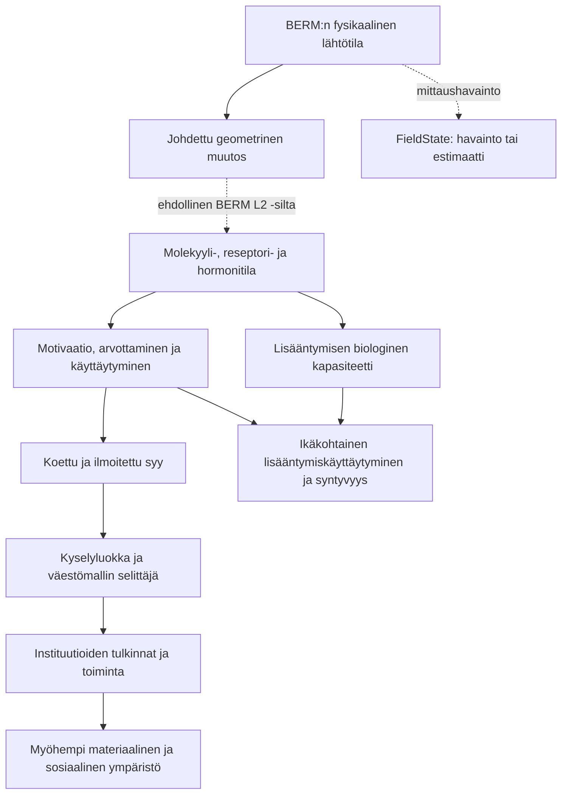

# BERM: proxy masking -sivun toteutussuositus

**Toteutuksen päivitys 8.9.2026:** oma alasivu, kahdeksan osan lukupolku, johdannot ja neljä havainnollistusta on toteutettu paikalliseen työpuuhun. Katso [toteutus ja esitystavan perustelut](BERM_proxy_masking_toteutus_2026-09-08.md). Alla oleva suunnitelma säilyy suunnitteluhistoriana; ajantasainen esitys on uudella `/model/proxy-masking`-sivulla.

**Työjärjestyksen päivitys 8.9.2026:** käyttäjä täsmensi tavoitteeksi ensin mahdollisimman vahvan historiallisen BERM-steelmanin ja sentinellilajeihin perustuvan selityskokonaisuuden. Alla oleva arkistoitu ennuste- ja falsifikaatio-osuus ei kuulu nykyiseen työvaiheeseen. Sisältöpohjana ovat [historiallinen steelman-synteesi](BERM_proxy_masking_historia_ja_sentinellit_steelman_2026-09-08.md) ja sitä täydentävä [sensorisen säätelyn, raskasmetallien, Klimentidiksen, ekologian ja Amish-aineistojen synteesi](BERM_proxy_masking_lisat_2026-09-08/README.md). Jälkimmäinen laajentaa sivun tilastollisesta peittymisestä biologisiin signaaleihin, yhteisaltistuksiin ja kompensaatioon. Näitä viittä aineistokokonaisuutta käsitellään sivun runkona.

Päiväys: 8.9.2026. Tarkastelun pohjana käyttäjän toimittama raportti, tämänhetkinen työpuu, BERM:n arkkitehtuurisopimus ja jäljempänä nimetyt menetelmälähteet. Tämä on sisältö- ja toteutusanalyysi; sivustoa ei muutettu tai julkaistu. Liitteen kaikkia biologisia tutkimusväitteitä ei tässä tarkastettu alkuperäistutkimuksiin asti.

**1. Suositus ja sivun tehtävä**

Proxy masking ansaitsee oman sivun. Se yhdistää BERM:n kausaalimallin siihen, mitä tutkimusasetelmissa voidaan havaita ja päätellä. Lukijan pitää ymmärtää, miten sama lopputulos voi saada uskottavan lähiselityksen, vaikka selitysketjun aikaisempi tekijä jäisi mittaamatta.

Suositeltu osoite on `/fi/model/proxy-masking`, kielestä riippumaton reitti `/model/proxy-masking`. Otsikko: **Proxy masking – miten taustalla oleva vaikutus voi peittyä**. Valikon nimi: **Vaikutuksen peittyminen**. Termi *proxy masking* säilytetään otsikossa ja määritelmässä löydettävyyden vuoksi. Englanniksi: *Proxy masking: how an upstream effect can remain hidden*.

Keskeinen väite kannattaa ilmaista näin: **BERM ehdottaa, että osa havaituista käyttäytymis- ja väestömuutosten selityksistä voi olla saman vaikutusketjun välivaiheita tai sen kanssa korreloivia mittareita. Niiden selitysvoima ei yksin ratkaise, mistä ketju alkaa.**

Sivun tulee selittää mekanismi, koota sen osille olemassa oleva biologinen näyttö ja näyttää, mitä eri alojen havaintojen yhdistäminen lisää BERM:n rakenteeseen. Tilastollinen attribuutio yhdistetään signaalin tuottamiseen, vastaanottavuuteen, yhteisaltistukseen ja toiminnan kompensaatioon. EMF:n kausaalinen osuus ja eri järjestelmien väliset siirrot merkitään täsmällisesti kunkin lähteen kohdalla.

**2. Kiinnitys nykyiseen BERM-malliin**

Nykyinen malli käyttää vuoden 2025 Weyl/GME-muotoilua. Lindgrenin ym. alkuperäisen artikkelin yhtälö (5) on

\[
g_{\mu\nu}=\eta_{\mu\nu}+A_\mu A_\nu.
\]

BERM:n yksikköasteikon näkyväksi tekevä kirjoitusasu on \(g=\eta+\kappa A\otimes A\). Vuoden 2021 singularista \(g=A\otimes A\) -muotoa ei yhdistetä tähän. Kun BERM:ssä asetetaan \(A=A_{\rm bio}+a_{\rm ext}\), vähennys lähtötilasta antaa

\[
\delta g_{\mu\nu}
=\kappa(A_{{\rm bio},\mu}a_{{\rm ext},\nu}
+a_{{\rm ext},\mu}A_{{\rm bio},\nu}
+a_{{\rm ext},\mu}a_{{\rm ext},\nu}).
\]

Tämä on tensorimuotoinen geometrinen seuraus ilmoitetuista oletuksista. Biologinen vaste edellyttää BERM:n ehdollista operaattoria, esimerkiksi

\[
\delta\langle O_i(t)\rangle
=\int_0^\infty K_i^{\mu\nu}(\tau;S_i(t-\tau))
\delta g_{\mu\nu}(t-\tau)\,d\tau
+\text{korkeamman kertaluvun vaste}.
\]

Minimaalinen aine–metriikkakytkentä ja viiveellinen vasteformalismi ovat tämän operaattorin lisäoletuksia. Gauge-resepti, fysikaalinen asteikko, kudosytimen muoto, etumerkki, viive ja ihmispäätepistekalibrointi ovat avoimia. `χ_geo` on geometrinen koordinaatti. Siitä ei voi päätellä yleistä biologista herkkyyttä.

Lähde: [Lindgren, Kovacs & Liukkonen 2025, ennakkoversio ja julkaistun artikkelin tiedot](https://www.preprints.org/manuscript/202503.2321). Projektin täsmällinen sopimus: [model-architecture.json](../../website/data/model-architecture.json) ja toteutus [lindgren_response.py](../../berm/berm/physics/lindgren_response.py).

Sivun BERM-kohtainen johtopäätös on ehdollinen: jos mitattu suure hävittää relevantteja kentän suunta-, spektri-, ajoitus- tai taustatietoja tai analyysi yhdistää erilaisia kudosvasteita, se voi menettää BERM:n ehdottaman vasteen kannalta olennaista tietoa. Geometria ei yksin määrää, paljonko havaittu yhteys vaimenee tai onko biologista vaikutusta kyseisessä asetelmassa.

Pidetään näkyvissä neljä lähdeluokkaa: **Lindgrenistä johdettu geometria**, **tuotu empiirinen biologia**, **BERM:n ehdollinen mekanismi** ja **avoin kalibrointi**. Tilastolliset identifikaatioperiaatteet ovat tuotuja menetelmiä. Ne eivät validoi Lindgrenin premissiä.

FieldState voi toimittaa havaintoja tai estimaatteja fysikaalisesta syötteestä. Se on mittaushaara; vasteoperaattori ja biologiset sekä väestölliset päätelmät kuuluvat BERM:lle. Kanoninen mittausreitti pysyy `/measurement/fieldstate`.

**3. Sivun kahdeksan sisältöosaa — päivitetty sensorisen dokumentin ja neljän evidenssisivun perusteella**

| Osa | Lukijan kysymys | Suositeltu esitys |
|---|---|---|
| 1. Ydinajatus | Miten uskottava selitys voi jättää aikaisemman syyn avoimeksi? | Lyhyt johdanto ja yksi läpi sivun kulkeva esimerkki |
| 2. Vihje ja vastaanottaja | Miksi sama vihje voi tuottaa erilaisen vasteen? | IPM, oksitosiini, aistirata ja valohistoria |
| 3. Kemikaalin ja kentän yhteisehdot | Mitä ulkoinen annos jättää kertomatta? | Kanavakuljetus, nimetyt yhteisaltistukset ja kemikaali–sähkövihje-ketju; raskasmetallisivu |
| 4. Kompensaatio ja havaittavuus | Voiko toiminta säilyä yhden reitin muuttuessa? | Vaihtoehtoiset aistivihjeet, paikallinen vaste, mittaus ja tilastollinen peittyminen |
| 5. Lajivertailu | Mitkä selitykset kattavat myös muita eläimiä? | Klimentidis ja toiminnon perusteella valitut ekologiset sentinellit |
| 6. Ryhmänimen sisältö | Mitä kulttuuri- tai elämäntapaluokka kokoaa yhteen? | Amish-aineiston aktiivisuusmittaus, pölysiirto ja altisteiden erottaminen |
| 7. Biologiasta koetuksi syyksi | Voiko biologinen tila edeltää vilpitöntä perustelua? | BERM:n ehdollinen ketju ja sosiaalisen sekä biologisen ympäristön palaute |
| 8. Mitä kirjallisuudesta on jo koottu? | Mitkä osat on mitattu ja mitä niiden yhdistäminen lisää? | Lähteistetyt tapauskortit: empiirinen komponentti, BERM-liitos ja avoin kalibrointi |

Ensimmäinen julkaisu voisi olla noin 1 500–2 200 sanaa kummallakin pääkielellä. Matemaattiset ehdot ja väitekohtainen auditointi avautuvat lisätietoina. Raportin kaikkien 13 luvun siirtäminen sellaisenaan tekisi sivun pääajatuksesta vaikean löytää.

**4. Kaksi kausaalirakennetta on erotettava heti**

Korrelaatiotapauksessa modernisaatio voi muuttaa sekä fyysistä ympäristöä että koulutusta, toimeentuloa, asumista ja tietoympäristöä. Näistä monet voivat vaikuttaa tarkasteltavaan lopputulokseen myös omia reittejään. Siksi EMF:n kanssa korreloiva muuttuja ei muutu automaattisesti näennäisselitykseksi.

Välittymistapauksessa BERM puolestaan ehdottaa ketjua fysikaalisesta tilasta biologiseen vasteeseen, siitä käyttäytymiseen ja edelleen väestöhavaintoon. Silloin käyttäytyminen voi olla todellinen lähisyy ja samalla aikaisemman vaikutuksen välittäjä. Tämä vastaa suoraan käyttäjän tarkoittamaa syyn peittymistä siitä juontuvien selitysten alle.

Kaavio on BERM:n ehdottaman rakenteen havainnollistus. Alavirran nuolet tarvitsevat kukin oman komponenttinäyttönsä. Väestösiirtymässä täsmennetään ikä, parin muodostuminen, yritykset, hedelmöittyvyys, raskauksien lopputulokset ja ajoitus. Yksilön hormonimuutos ei itsessään ole TFR-ennuste. Instituutioiden palaute esitetään myöhempään aikaan kohdistuvana vaikutuksena; normeja ja taloutta käsitellään ihmisten toiminnan, oppimisen ja materiaalisten rajoitteiden kautta.

Ilmoitettu syy on itsessään todellinen havainto, ja se voi vaikuttaa myöhempään toimintaan. Kyselyvastaus ei yksin tunnista oman syntyhistoriansa kaikkia vaiheita. Tämä on täsmällisempi lähtökohta kuin väittää ihmisten perusteluja yleisesti vääriksi tai kaikkia kulttuurimuutoksia EMF:n tuottamiksi.

**5. Peittymisen mekanismit ja visualisointi**

| Mekanismi | Mikä voisi jäädä näkymättä? | Mitä pitäisi näyttää tai mitata? |
|---|---|---|
| Puuttuva selittäjä ja korreloivat muuttujat | Eri muuttujat ennustavat samaa vaihtelua; puuttuva syy voi muuttaa mukana olevien kertoimia | Vaihtoehtoiset kausaalirakenteet, riippumaton vaihtelu ja herkkyysanalyysi |
| Välittäjän vakiointi | Osa kokonaisvaikutuksesta kulkee vakioidun muuttujan kautta | Kokonaisvaikutus ja suora vaikutus erikseen; ajallinen järjestys |
| Mittausvirhe ja epäsopiva altistusmittari | Laitekäyttö tai liittymätiheys ei säilytä relevanttia fysikaalista vaihtelua | Fyysiset mittaukset, mittausvirheen rakenne ja mittareiden vertailu |
| Eri vaste-ehtojen yhdistäminen | Vastakkaiset, viiveelliset tai vain tietyissä olosuhteissa esiintyvät vasteet voivat keskiarvoistua | Ennalta nimetyt tilat, spektrit, ajoitus ja interaktiot |
| Ilmoitetun syyn muuttuminen alkuperäisselitykseksi | Ketjun jälkipään mittari tulkitaan sen alkupään syyksi | Biologian, käyttäytymisen ja ilmoitettujen syiden toistomittaukset |

Samaan muuttujaan voi kohdistua eri rooleja eri aikoina. Esimerkiksi lähtötilan BMI ja altistuksen jälkeen muuttunut BMI eivät ole automaattisesti sama kausaalinen muuttuja. Kausaaliroolia ei päätetä nimen eikä regressiotuloksen perusteella. Myös yhteisen seurauksen vakiointi voi avata harhaisen yhteyden.

Vuorovaikutteisen kuvan suositeltu toiminta: lukija valitsee **korreloivan muuttujan**, **välittäjän**, **epätarkan mittarin** tai **eri vasteiden yhdistämisen**. Kuva näyttää oletetun kausaalirakenteen ja tutkimuksessa näkyvän osan. Valinta ”vakioi välittäjä” valaisee poistetun reitin ja kertoo, että tutkimuskysymys vaihtuu kokonaisvaikutuksesta suoran vaikutuksen arviointiin, jonka tunnistamiseen tarvitaan vielä lisäoletuksia.

Simuloidut luvut merkitään näkyvästi opetusesimerkeiksi. Mukaan kuuluu myös esimerkki, jossa EMF:n kausaalikerroin on nolla mutta yhteinen taustatekijä tuottaa korrelaation. Näin lukija oppii, mitä kaavio voi ratkaista. Toteutus onnistuu pienellä saavutettavalla komponentilla; kaaviolla pitää olla tekstivastine ja näppäimistökäyttö.

Menetelmäperusta: [Schisterman, Cole & Platt 2009](https://pmc.ncbi.nlm.nih.gov/articles/PMC2744485/) osoittaa kokonaisvaikutukseen kohdistuvan ylivakioinnin ongelman; [Liu 1988](https://pubmed.ncbi.nlm.nih.gov/3354551/) käsittelee mittausvirhettä osittaiskorrelaatioissa ja monimuuttujamalleissa. Monimuuttujatilanteessa mittausvirhe ei takaa kaikkien kertoimien vaimenemista. [Cinelli & Hazlett 2020](https://academic.oup.com/jrsssb/article/82/1/39/7056023) tarjoaa tavan arvioida, kuinka voimakas puuttuva tekijä tarvittaisiin johtopäätöksen muuttamiseen. Nämä menetelmät eivät yksilöi puuttuvaa tekijää EMF:ksi.

**6. Raportin väitteet ennen julkaisua**

| Raportin kohta | Tarkistuksen tulos tai tarvittava rajaus | Toimenpide |
|---|---|---|
| ”OLS jakaa selitysvoiman ensimmäiselle muuttujalle” | Yhdessä sovitetun tavallisen OLS:n kertoimet eivät riipu sarakkeiden järjestyksestä. Sekventiaalinen varianssin jako on eri asia. | Korvaa puuttuvan muuttujan harhalla ja yhteisen ennustevaihtelun kuvauksella. |
| Myrskylä ym. 2009, ”92 muuttujaa” | Alkuperäinen tutkimus käsittelee HDI–TFR-yhteyttä ja sen muuttumista korkealla kehitystasolla. | Poista virheellinen esimerkki tai kirjoita se alkuperäisartikkelin mukaisesti. |
| R² 0,394 / 0,433 / 0,448 ja osittaiskorrelaatiot −0,37 / −0,25 | Näiden täsmällistä laskentaa ja aineistoa ei paikannettu nykyisestä repositoriosta tässä tarkistuksessa. | Julkaise tuloksina vasta, kun otos, muuttujat, estimointi ja laskenta ovat jäljitettävissä. |
| Muiden muuttujien lisäarvo ”3,9 prosenttiyksikköä” | Raportin omilla luvuilla 0,448 − 0,394 = 0,054. | Korjaa 5,4 prosenttiyksiköksi. |
| Lajienvälinen r = 1,000 | Tarkkaa laskentaa ja mitattuja yhteismitallisia EMF-arvoja ei paikannettu. Kolmen lajin järjestys ei tunnista altistetta. | Säilytä mahdollisena vertailuasetelmana; älä esitä ratkaisevana kausaalitodisteena. |
| Yhteisövertailun R² ≈ 0,999 | Rekisterissä viisi pistettä, neljä sovitettavaa parametria ja oletetut altistusarvot. | Historiallinen skenaarioesimerkki; ei mitattu annos–vaste tai riippumaton validointi. |
| SDI ”eliminoi kaikki käyttäytymisproxyt” | Biologinen päätepiste voi auttaa erottamaan selityksiä, mutta ei automaattisesti poista valikoitumista, muita altisteita, elämäntapoja tai mittausongelmia. | Kuvaa biologisen päätepisteen hyöty ja jäljelle jäävät kilpailijat; maataso ei yksin tunnista yksilömekanismia. |
| 35 harhaa, kaikki samaan suuntaan | Osa on mahdollisia asetelmaongelmia, osa mallioletuksia ja osa lähteistettäviä institutionaalisia väitteitä. | Ryhmittele mekanismin ja sen ehtojen mukaan. Harhojen lukumäärää ei käytetä evidenssin määränä. |
| ”83 % vaikutuksesta peittyy” | 0,7⁵ ≈ 0,168 on laskettu viidestä oletetusta kertoimesta. Kertoimia ja niiden yhdistämissääntöä ei ole tällä osoitettu. | Ainoastaan havainnollistava herkkyysskenaario. |
| ”5/5 identifikaatiostrategiaa vahvistettu” | Täsmällistä viiden testin rekisteriä ja tulosaineistoa ei paikannettu. Nykyiset INTERP-1–4 ovat OPEN. | Näytä jokaisen testin todellinen vaihe ja riippumattomuus erikseen. |
| Amish–mormoni, teknologiaportaat ja COVID luonnollisina kokeina | Fyysinen altistus sekä muut samanaikaiset muutokset on erotettava. Palvelun käyttöönotto muuttaa myös sisältöä ja toimintaa. | Ehdokkaiksi, kunnes identifikaatioehdot ja mittaukset täyttyvät. |
| Sigmoidisuus tai viive erottaa biologian kulttuurista | Myös oppiminen, teknologian leviäminen ja väestöprosessit voivat sisältää kynnyksiä ja viiveitä. | Vertaa ennakkoon määriteltyjä, täsmällisiä kilpailevia malleja. |
| Faraday-koe ”ratkaisee lopullisesti” | Testi koskee valittua kenttää, biologista päätepistettä ja asetelmaa. Suojausta ei voi rinnastaa kaiken EMF:n poistoon. | Mitattu aktiivinen ja lumealtistus, määritelty kontrasti ja päätetapahtuma; otoskoko perustellaan voimalaskelmalla. |
| Rahoitus, ICNIRP ja julkaisuharha | Raportin motiivi- ja suuntaväitteet vaativat omat aineistonsa ja alkuperäislähteensä. | Rajattu jatkolinkki Epistapegeen; ei sivun aloitusargumentiksi. |

Myrskylä-korjauksen lähde: [Myrskylä, Kohler & Billari 2009, Nature](https://pubmed.ncbi.nlm.nih.gov/19661915/). Yhteisösovituksen rajaukset ovat projektin [parametrirekisterissä](../../berm/data/registry/parameter_registry.csv), `sigmoid_v7.a` ja `community_emf.OldOrderAmish`; luvut löytyvät [countries.py-tiedostosta](../../berm/berm/data/countries.py).

Jos R²-luvut myöhemmin varmistetaan saman otoksen, saman lopputuloksen ja yhteensopivien OLS-mallien luvuiksi, voidaan näyttää niiden ennustevaihtelun ositus: yhteinen osa 37,9 prosenttiyksikköä, EMF-mittarin yksilöllinen lisäosa 1,5, muiden muuttujien yksilöllinen lisäosa 5,4 ja selittämättä 55,2. **Yhteiselle osalle ei tämän laskun perusteella voi nimetä kausaalista omistajaa.** Luku 0,394 / 0,433 ≈ 91 % on kahden selitysasteen suhde, ei EMF:n osuus muiden muuttujien aiheuttamista vaikutuksista.

**7. Arkistoitu myöhempi vaihe: testit ja ennusteet — ei nykyiseen sivuversioon**

Ensimmäinen tutkimuslinja on toistomittaus: fyysinen kenttä, biologinen tila, käyttäytyminen ja ilmoitetut syyt mitataan samassa yksilöpaneelissa. BERM:n tulkkihypoteesissa biologisen muutoksen pitäisi tuoda ennakkorekisteröityä lisätietoa myöhempään käyttäytymiseen ja ilmoitettuihin syihin. Kilpailijana testataan myös vastakkainen ajallinen suunta sekä yhteiset sosiaaliset ja materiaaliset syyt. Pelkkä biologian ennustearvo ei tunnista sen mahdollista EMF-alkuperää.

Toinen tutkimuslinja on sokkoutettu fyysisen kentän muutos, jossa sisältö, käytettävissä oleva tieto, valo, ääni, lämpötila ja muut keskeiset olosuhteet säilytetään vertailukelpoisina. Ennakkoon nimetään kenttäominaisuus, vasteen ehto, päätepiste, ajallinen ikkuna ja käytännössä merkityksellinen vaikutuskoko. Puhelimen käyttökielto yksin ei erota fyysistä kenttää sisällöstä. Nollatulos riittävällä tarkkuudella heikentää kyseistä kenttä–vaste-hypoteesia.

Kolmas linja on mitatun altistusvaihtelun hyödyntäminen maa- ja aikarajojen yli. Ennakkoon määritellyt mallit arvioidaan kokonaan syrjään jätetyissä maissa ja ajanjaksoissa; tarkistetaan yhteiset trendit, muut altisteet ja muuttujien riippuvuus. Instrumenttiehdokkaalle tarvitaan perustelu myös sille, ettei se vaikuta päätepisteeseen muita reittejä pitkin. Topografia tai verkkouudistus ei ole automaattisesti kelvollinen instrumentti.

Nykyiset [INTERP-1–4-ehdokkaat](../../website/lib/interpreterPredictions.ts) ja [model/comparison-sivu](../../website/app/[locale]/model/comparison/page.tsx) tarjoavat pohjan. Niiden avoin tila säilytetään näkyvänä.

Sivun ennustekortissa erotellaan aina:

- **BERM:n ehdollinen ennuste:** nimetty kenttäkontrasti ja etukäteen määrätty kudosvaste tuottavat nimetyn biologisen ja mahdollisen käyttäytymisvasteen.
- **Kilpaileva ennuste:** esimerkiksi pelkkään sisältöön perustuva malli ei ennusta kentän muutoksen vaikutusta sisällön pysyessä samana. Muut fysikaaliset biologiamallit voivat ennustaa vaikutuksen.
- **Erottelukyky:** fyysisen vaikutuksen osoittaminen voi erottaa sen sisältöselityksestä. Lindgren-pohjaisen BERM:n erottaminen muusta EMF-biologiasta vaatii vielä yksilöidyn eriävän ennusteen. Tausta-, suunta- tai ajoitusriippuvuus ei yksin ole ainutlaatuinen Lindgren-signatuuri.

Peittymisen selitystä heikentäisi se, että laadukkaammat altistusmittaukset eivät tuo lisäennustetta, ennakkoon määritelty biologinen välitys ei toistu tai täsmällinen kenttäinterventio rajaa vaikutuksen oletettua pienemmäksi. Tarkasteltu vaikutuskoko, epävarmuus ja testattu reitti nimetään. Jokaisen nollatuloksen jälkikäteinen selittäminen uudella peittäjällä tekisi testistä merkityksettömän.

**8. Yhteydet nykyisiin sivuihin**

| Sivu | Muutos tai työnjako |
|---|---|
| Etusivu | Nykyinen ProxyMaskingInfographic korvataan mekanismia esittävällä tiiviillä kuvalla ja jatkolinkillä. |
| `/model` | Lyhyt johdanto ja linkki kausaalirakenteen yhteyteen. Nykyisen BMI-sekoittaja/välittäjätekstin ehdottomuus sovitetaan samaan roolierotteluun. |
| `/civilization/epistapege` | Omistaa laajan biologinen tila → perustelu → instituutio -esityksen; molemminpuolinen linkki. |
| `/behavior` | Käyttäytymis- ja perustelumekanismien jatkolukeminen. |
| `/evidence/response-conditions` | Kentän ja vastaanottajan tilaan liittyvien ehtojen tarkempi perustelu. |
| `/evidence/heavy-metal-synergy` | Yhteisaltistus, sisäinen annos ja vastaanottavuus. Suorat kenttä–kemikaalikokeet erotetaan kentättömistä kanavakokeista. |
| `/evidence/klimentidis-explained` | Lajivertailu avaa ravinnonkäytön ja energiansäätelyn aikaisempien syiden kysymyksen. |
| `/evidence/ecology` | Sähköiset vihjeet, optinen ajoitus, toiminnallinen kenttävaste ja aistien kompensaatio. |
| `/evidence/amish-control` | Yhteisönimen sisältämät materiaaliset altistukset, aktiivisuuden mittausero ja pölyvälityksen koe. |
| `/measurement/fieldstate` | Fyysisen mittauksen rakenne, epävarmuus ja ero teknologiaproxyyn. |
| `/model/comparison` | Täsmällinen mallivertailu ja sen nykyiset identifikaatiorajat. |
| `/epistemology` | Mittarin, mekanismin ja selitystason erottelu. |

Etusivun [ProxyMaskingInfographic.tsx](../../website/components/ProxyMaskingInfographic.tsx) sisältää nyt käsin kirjoitetut käyrät ja kyllä/ei-pisteet sekä otsikon ”Kahdeksan selitystä testattu. Yksi toimii.” Alkuperäinen [suunnitteludokumentti](../codelle/BERM_CODELLE_moderaattorianalyysi_DEFINITIVE.md) nimeää pisteytyksen heuristiikaksi, jossa ei ole tilastollista inferenssiä. Tämä ero pitää korjata samalla julkaisulla, jotta etusivu ja uusi sisältö puhuvat samasta asiasta.

**9. Toteutuspaketti ja hyväksymiskriteerit**

Ensimmäinen vaihe: uusi `website/app/[locale]/model/proxy-masking/page.tsx`, täydet suomen- ja englanninkieliset tekstit, havainnollistava kaavio sekä neljän keskeisen evidenssisivun ja muiden jatkosivujen linkit. Valikkoon lisätään yksi lapsireitti nykyisen Malli-osion alle `website/lib/navigation.ts`-tiedostossa. Sivuston seitsemän pääosion rakenne säilyy; uuden sivun sisällä on yllä kuvatut kahdeksan sisältöosaa.

Toinen vaihe samassa julkaisukokonaisuudessa: etusivun kuvan korvaaminen sekä uuden sivun kannalta keskeisten BMI-vakiointia koskevien väitteiden yhdenmukaistus. Laaja todistustaulukko julkaistaan vasta sen tulosten toistettavuuden tarkistuksen jälkeen. Vuorovaikutteinen opetusesimerkki voidaan lisätä ensimmäiseen vaiheeseen, jos sen kolme tai neljä tilaa pysyvät helposti ymmärrettävinä.

Uudet malliväitteet kirjataan tarvittaessa `claims.json`-rekisteriin luonnoksina ja ankkuroidaan `ClaimRef`-viitteillä. Havaintoon viittaavalle kortille kirjataan aineisto, havaintoyksikkö, otoskoko, aika, altistusmittari, analyysi, epävarmuus, kilpailevat selitykset ja mitä ketjun kohtaa tulos koskee. Rekisterin `routes[]` on päättelyreittien rakenne; uusi verkkosivu ei itsessään muodosta riippumatonta evidenssireittiä.

Käännöksissä käytetään `pickCopy`-varakieltä ja pitkällä sivulla `TranslationNotice`-ilmoitusta. Valikko-otsikot ja kuvaukset kirjoitetaan kaikille viidelle kielelle. Sivukartan nykyinen staattisten reittien löytäminen tarkistetaan uuden reitin osalta.

Toteutuksen valmistuessa tarkistetaan sivun löytyminen valikosta, kaikki kielireitit ja ankkurit, lähde- ja väiterekisterit, saavutettava tekstivastine ja mobiililuettavuus. Mahdollisen simulaation kausaalinen sisältö ja laskenta tarvitsevat rajatun toiminnallisen tarkistuksen. Nykyiset tyyppi-, lint-, kielikattavuus- ja tuotantokäännöksen tarkistukset sekä BERM/FieldState-arkkitehtuuritestit kuuluvat toteutuksen laadunvarmistukseen.

Julkaisukelpoinen sivu onnistuu silloin, kun lukija osaa sen jälkeen erottaa **korreloivan mittarin, välittävän mekanismin ja alkuperäisen syyn**, ymmärtää BERM:n ehdottaman yhteyden niiden välillä ja pystyy nimeämään havainnon, joka muuttaisi hänen arviotaan.
