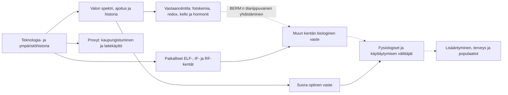

# BERM: valo, vastaanotintila ja proxy masking

**Kirjallisuussynteesi 8.9.2026.** Tavoitteena on vahvistaa BERM:n selitysrakennetta olemassa olevasta tutkimuksesta ennen ennusteiden rakentamista. Tämä raportti jatkaa [historiaa ja sentinellejä käsittelevää steelmania](../BERM_proxy_masking_historia_ja_sentinellit_steelman_2026-09-08.md) ja täsmentää [teknologiakatsauksen](../BERM_EMF_teknologia_kirjallisuuskatsaus_2026-09-08.md) kohtia 5.2 ja 9.1–9.2.

## 1. Mitä voimme jo vahvistaa?

**Valo kuuluu BERM:n biologisessa mallissa sekä vaikuttaviin kenttiin että vastaanottajan tilaa muodostaviin tekijöihin.** Tätä rakennetta voidaan jo ankkuroida kokeisiin. Valon valmistama tila, magneettiherkkä reaktiovaihe ja hitaampi fysiologinen vaste on mahdollista erottaa toisistaan. Silloin valon ja muun kentän yhteisvaikutus voi säilyä myös peräkkäisissä altistuksissa.

Kirjallisuus antaa kokonaisuuteen seuraavat vahvistukset:

| Vahvistettava rakenne | Mihin olemassa oleva näyttö yltää? | Malliin tuleva täsmennys |
|---|---|---|
| **Valo valmistaa myöhempää kenttäherkkää tilaa** | Arabidopsiksen kryptokromivasteessa kentän antaminen valopulssien jälkeisessä pimeydessä muutti kasvuvastetta. | Valon ja kentän järjestys sekä niiden välinen viive kuuluvat altistukseen. |
| **Kenttävaste riippuu solun aineenvaihdunnasta ja vastaanottimista** | C2C12-soluissa valohistoria, CRY2, riboflaviinikinaasi ja TRPC1 liittyivät PEMF-vasteeseen. | Yksi vakioinen kudosherkkyys korvataan mitattavilla solutilan komponenteilla. |
| **Nopea fysikaalinen tapahtuma voi välittyä hitaampaan kemiaan** | Flaviinien fotokemiallinen vahvistuminen sekä proteiinien RF-ohjattu spinikemia ovat kokeellisia havaintoja. | Spinidynamiikalla, kemiallisella kertymällä ja biologisella muistilla on eri aika-asteikot. |
| **Sama nykyinen valoannos ei aina tuota samaa vastetta** | Ihmisten kontrolloiduissa kokeissa aiempi valo muutti myöhempää melatoniinin vaimenemista ja vuorokausivaiheen siirtymää. | Valohistoriaa ei voi korvata yhdellä mittaushetken lux-arvolla. |
| **Hormoni voi muuttaa kenttävasteen signaalikäsittelyä** | Rotan hermosoluissa melatoniini vaimensi kentän lisäämää natriumvirtaa MT2-välitteisesti. Kalsiumvaste käyttäytyi eri tavoin. | Palaute on reitti- ja tilakohtaista; yhtä yleistä suojaavaa tai voimistavaa merkkiä ei aseteta. |
| **Valoympäristö ulottuu lisääntymisfysiologiaan ilman ihmisen kulttuurisia päätöksiä** | Viiriäisillä, lampailla, mustarastailla ja yöperhosilla on mekanistista tai kokeellista valo–lisääntymisnäyttöä. | Sentinellit yhdistävät ympäristön, vastaanottimen, hormonit, käyttäytymisen ja lisääntymisvaiheen. |
| **Historiallinen muutos voi peittyä mittarin alle** | Satelliitin radianssi, maasta havaittu taivaankirkkaus ja vastaanottajan annos kuvaavat eri asioita; muuttuva spektri voi muuttaa niiden suhdetta. | Myös altistuksen mittaamisessa esiintyy proxy maskingia. |

Taulukon keskeiset alkuperäisankkurit ovat [Hammad 2020](https://doi.org/10.1039/C9PP00469F), [Iversen 2025](https://doi.org/10.3390/cells14030231), [Kattnig 2016](https://doi.org/10.1038/nchem.2447), [Meng 2026](https://doi.org/10.1038/s41587-026-03158-5), [Liu 2014](https://doi.org/10.1111/jcmm.12250), [Yoshimura 2003](https://doi.org/10.1038/nature02117) ja [Kyba 2017](https://doi.org/10.1126/sciadv.1701528). Ihmisten valohistoriatutkimukset ja niiden protokollat on eritelty [kronobiologiamuistiossa](chronobiology.md).

**BERM:n vahvistuva oma väite on vastaanoton tilariippuvuus ja eri aikatasojen yhdistäminen.** Komponenttikokeista muodostuu aiempaa täsmällisempi selitys sille, miten saman ympäristölähteen vaste voi näkyä yhdessä tutkimuksessa unena, toisessa redox-tilana ja kolmannessa lisääntymisen ajoituksena. Koko ketjun ihmisen pitkäaikainen RF–sairastavuus- tai RF–syntyvyysosuus säilyy erikseen kalibroitavana.

## 2. Haun rakenne ja evidenssin yhdistäminen

Haku jaettiin rinnakkain neljään tutkimusalueeseen: fotokemia ja solusignalointi; ihmisten kronobiologia ja melatoniinifarmakologia; ekologiset ja lajikohtaiset kokeet; fysikaalinen rakenne, vuodenaikainen endokrinologia ja altistushistoria. Nimettyjen tutkimusten DOI- ja otsikkohaun lisäksi seurattiin niiden lähdeviitteitä ja etsittiin viereisten alojen kokeita samoista välittäjistä. Ensisijaisia lähteitä ovat julkaisijoiden alkuperäisartikkelit, PubMed/PMC ja Europe PMC:n kokotekstit sekä tekijöiden julkaisuarkistot.

Tämä on laaja kohdennettu kirjallisuussynteesi. Hakutulosten kokonaismäärää tai PRISMA-seulontaa ei rekonstruoida jälkikäteen. Poiminnat kertovat, tarkistettiinko kokoteksti, menetelmät, abstrakti vai julkaisijan tuloskatkelma. Puuttuvaa annosta ei täytetä katsauksen arviolla ja esitetä alkuperäisestä varmennettuna.

**Lähderekisterissä on 59 yksilöityä lähdettä:** 54 empiiristä alkuperäistutkimusta, yksi alkuperäinen laitemittausraportti, Lindgrenin teoriatyö, yksi vuoden 2026 esipainos ja kaksi CIE:n mittaus-/raportointiohjetta. Neljän osaraportin 64 poiminnasta yhdistettiin viisi päällekkäistä artikkeliesiintymää DOI:n perusteella. Julkaisujen määrä ei ole riippumattomien koesarjojen määrä: esimerkiksi Dominonin kolme artikkelia käsittelevät samaa kohorttia.

Osaraportit sisältävät tutkimuskohtaiset annokset, lajit, päätepisteet, tulokset ja tutkimusperheiden riippuvuudet:

- [Fotokemia, kryptokromit ja solujen kenttävasteet](photochemistry.md).
- [Ihmisten valohistoria, melatoniini ja fysiologia](chronobiology.md).
- [Ekologia, sentinellit ja valaistuksen sähköiset päästöt](ecology.md).
- [Fysiikka, kemiallinen muisti, fotoperiodi ja historia](physics_and_history.md).
- [Yhdistetty lähderekisteri](sources.json), jossa saman DOI:n esiintymiset yhdistetään.

Eri alojen tulokset liitetään **nimettyihin ketjun nuoliin**. Esimerkiksi iltavalo→melatoniini on mitattu ihmiskokeissa ja melatoniini→ELF-vasteen muutos solukokeessa. Niiden yhdistelmästä saadaan biologisesti perusteltu BERM-silta, jonka annos- ja kudosvastaavuus kirjataan näkyviin. Kahden nuolen erillinen näyttö ei muutu samassa ihmisessä mitatuksi kokonaisketjuksi.

## 3. Valon kolme tehtävää ja BERM:n rakenne

Optinen säteily, ELF, IF ja RF ovat sähkömagneettisen ympäristön eri osia; fotonit ovat sähkömagneettisen kentän kvantteja. Kaistajako kuvaa taajuutta, kudokseen siirtymistä, absorptiota ja vastaanottomekanismia. Biologisesti tehokas annos määritellään kunkin vastaanottimen kannalta. Optinen fotonivirta, silmän melanoppinen annos, paikallinen magneettikenttä ja kudoksen indusoitunut sähkökenttä säilyvät eri suureina.

Valolle tarvitaan kolme tehtävää:

1. **Suora optinen vaste:** fotonin absorptio käynnistää fotoreseptorin tai muun kromoforin reaktion.
2. **Kenttäherkkyyden säätely:** valo muuttaa esimerkiksi flaviinien redox-tilaa ja reaktiopopulaatioita, jolloin toisen kentän vaste muuttuu.
3. **Hidas tilanmuutos:** aiempi valo muuttaa vuorokausi- ja vuodenaikaista vaihetta, hormoneja, proteiinien ilmentymistä sekä solun aineenvaihdunnallista tilaa.

Näistä seuraa kaksi erilaista yhteisvaikutusta, jotka on säilytettävä erillisinä.

**Johdettu geometria.** Vuoden 2025 Lindgren-premississä BERM käyttää merkintää

\[
g=\eta+\kappa A\otimes A,\qquad
A=A_0+a_L+a_N,
\]

missä \(a_L\) on optinen osa ja \(a_N\) tässä muiden tarkasteltavien kaistojen summa. Hajotelman optisen ja muun osan suora ristiosa on

\[
\delta g_{LN}=\kappa(a_L\otimes a_N+a_N\otimes a_L).
\]

Valitussa aikakeskiarvossa tämä termi voi hävitä. Se on kyseisen fysikaalisen termin ominaisuus. [Lindgren ym. 2025](https://doi.org/10.1088/1742-6596/2987/1/012001).

**Tuotu biologia ja BERM:n ehdollinen silta.** Valo voi samalla muuttaa hitaampaa vastaanotintilaa. Tällöin BERM:n L2-operaattori kirjoitetaan eksplisiittisesti

\[
\boxed{\quad
\Xi_i(t)=\Xi_i\!\left[
\mathcal S_i\bigl(L_{\le t},N_{\le t},C_{\le t},\text{muu historia}\bigr)
\right].\quad}
\]

\(L\) tarkoittaa valoaltistusta, \(N\) muita tarkasteltavia kenttäkaistoja ja \(C\) kemiallista ympäristöä. Vastaanotintilaan voidaan sisällyttää valon valmistamat kemialliset tilat, CRY-alatyyppi ja määrä, flaviinisaatavuus, kalvo-orientaatio, redox, vuorokausivaihe, hormonit ja kehitysvaihe. Muuttujat otetaan mukaan siihen järjestelmään, jossa niiden rooli tunnetaan; kaikkien lajien ei oleteta käyttävän samaa reseptoria.

Kaavamainen BERM:n kenttävaste on

\[
\Delta R_{i,N}(t)=
\int_0^\infty
\Xi_i^{\mu\nu}\!\left(\tau;\mathcal S_i(t-\tau)\right)
\delta g_{N,\mu\nu}(t-\tau)\,d\tau.
\]

Tässä \(\delta g_N\) tarkoittaa määritellyn muun kentän muutokseen kuuluvaa osaa. Optinen suora vaste ja optisen historian tekemä tilamuutos eritellään kirjanpidossa, jotta samaa vaikutusta ei lasketa kahteen kertaan. Operaattorin tilariippuvuudesta voi seurata biologinen valo–kenttä-yhteisvaikutus, vaikka \(\langle\delta g_{LN}\rangle=0\). Optisen ja RF-kantoaallon koherenssia ei tarvita tälle välitetylle reitille.

**Avoin kalibraatio.** Geometrian gauge-määritys, \(\kappa\):n fysikaalinen asteikko, kudosytimet, vasteen suunta, viive ja ihmispäätepistekalibrointi eivät määräydy komponenttikokeista. \(\chi_{geo}\) säilyy geometrisena koordinaattina. FieldState voi toimittaa mitatun tai estimoidun kenttätietueen BERM:n syötteeksi; se ei tuota biologista operaattoria.

## 4. Seitsemän yhdistettävää evidenssiketjua

### 4.1 Valon valmistama tila → pimeän magneettiherkkä reaktio

Hammad ym. käyttivät Arabidopsiksella toistuvia viiden minuutin sinivalo- ja kymmenen minuutin pimeäjaksoja. Kryptokromivaste voimistui, kun 500 µT:n kenttä annettiin pimeävaiheessa; kentän antaminen vain valovaiheessa ei tuottanut vastaavaa vastetta. Aiempi Pooamin tutkimus kuuluu samaan pimeän reoksidaation tutkimuslinjaan. [Hammad 2020](https://doi.org/10.1039/C9PP00469F), [Pooam 2019](https://doi.org/10.1007/s00425-018-3002-y).

Hammadin menetelmässä valon sammumisen jälkeen oli ensin **10 sekuntia pimeää paikalliskentässä**, minkä jälkeen voimakkaampi kenttä annettiin pimeäjakson lopuksi. Tämä tekee ajallisesta erottelusta erityisen selkeän.

**Synteesi:** nykyinen pimeys ei tarkoita, ettei aikaisempi valo vaikuttaisi kenttävasteeseen. Tilan valmistaminen ja kentälle herkkä reaktiovaihe voivat tapahtua eri aikaan. Koe rajaa reaktion ajallista paikkaa; yksittäisen radikaaliparin molekyyli-identiteetti vaatii oman näyttönsä.

Tämä on proxy maskingille keskeinen mekanismi: tutkimus voi kirjata kenttäaltistuksen tapahtuneen pimeässä ja jättää aiemman valon pois, vaikka juuri esivalaisu määrää vastaanottimen tilan.

Albaqamin saman tutkimusperheen koe tuo tähän **suoran RF-haaran**. Arabidopsiksella 7 MHz:n, 2 ± 0,5 µT RMS:n kenttä vähensi CRY1:n fosforylaatiota ja heikensi sinivalon kasvunestovastetta. Samasta optisesta ärsykkeestä muodostui erilainen biologinen signaali. Tämä tukee yhteyden toista suuntaa: kenttä voi muuttaa myös sitä, miten valo vastaanotetaan. Annos ja 7 MHz:n kaista säilyvät tutkimuksen omina ehtoina. [Albaqami 2020](https://doi.org/10.1038/s41598-020-67165-5).

### 4.2 Nopea spinidynamiikka → kemiallinen kertymä → proteiinitila

Kattnigin kokeet osoittavat kemiallista magneettivasteen vahvistumista jatkuvan valon aikana. Mengin vuoden 2026 työ lisää suoran RF-ohjauksen ja optisen lukemisen flavoproteiineissa: noin 1,47 GHz:n resonanssi havaittiin noin 52,5 mT:n staattisessa kentässä, 447 nm:n valaistuksessa. Optinen signaali sisälsi hitaampaa kemiallisten tilojen kertymää. [Kattnig 2016](https://doi.org/10.1038/nchem.2447), [Meng 2026](https://doi.org/10.1038/s41587-026-03158-5).

Kishin vuoden 2026 esipainos antaa seuraavalle portaalle ehdokkaan: punarinnan Cry4a:n semikinonitilalla oli oma konformaatioprofiilinsa. Majewskan vertaisarvioitu tutkimus puolestaan osoitti Cry4a:n järjestyneen kalvokiinnittymisen riippuvan lipidikalvon tilasta. [Kish, esipainos v3](https://arxiv.org/abs/2604.19579v3), [Majewska 2025](https://doi.org/10.1021/acschembio.4c00576).

**Synteesi:** BERM voi kuvata tiedon siirtymisen muodossa spinivalinta→reaktiotuotto→kemiallisten tilojen jakauma→proteiinin rakenne ja kiinnittyminen. Pitkäkestoisen lopputuloksen ei tarvitse sijaita koko ajan samassa fysikaalisessa vapausasteessa. Tämä ketju kootaan eri proteiineista ja menetelmistä; Cry4a:n koko kenttä–konformaatio–hermostosignaali ei ole näissä töissä yksi valmis koe. Mengin laboratorioannos pysyy omana annoksenaan.

### 4.3 Valohistoria ja flaviinitalous → nisäkässolun kenttävaste

Iversenin vuoden 2025 C2C12-kokeessa 1,5 mT:n pulssikentän vaste heikkeni pimeässä kasvatuksessa sekä CRY2:n ja riboflaviinikinaasin vaimentamisen yhteydessä. TRPC1 kytkee tutkimuslinjan kalsiumin sisäänvirtaukseen ja aineenvaihduntaan. Tulosteksti tukee vasteen vaimenemista ja suuntavalikoivuuden muutosta; kaikkien kenttävasteiden täydellinen katoaminen olisi liian karkea yhteenveto. [Iversen 2025](https://doi.org/10.3390/cells14030231).

Saman tutkimuslinjan vuoden 2024 työ yhdisti puna-/lähi-infrapunavalon ja pulssikentän TRPC1:een ja mitokondriovasteisiin. Se tuo rinnalle muun optisen vastaanoton mahdollisuuden: puna-/lähi-infrapunavalon ja sinivalolla aktivoituvan kryptokromin ei oleteta olevan sama sisääntuloreitti. [Iversen 2024](https://pubmed.ncbi.nlm.nih.gov/39061719/).

**Synteesi:** reseptoritilan vähimmäissisältöön tulevat proteiinialatyyppi, flaviiniaineenvaihdunta, kanavareitti ja solun energiatalous. Soluviljelmän suora valaistus ja ehjän nisäkkään silmän kautta välittyvä valo ovat eri altistusgeometrioita. Ihmisen syvän kudoksen CRY2-valohistoriaa ei päätellä suoraan valaistusta solumaljasta.

Sensorin ja välittäjän tehtävät erotetaan myös toisistaan. Bradlaughin kärpäsen neuronikokeet tukevat flaviinin mahdollista sensoriroolia ja CRY:n erillistä välittäjäroolia. Sherrardin nisäkässoluissa puolestaan esiintyi CRY-riippuvaisia kenttävasteita pimeässä. **Valohistoria on siten yksi nimettävä tilareitti; välitön sinivalo ei ole kaikkien CRY-riippuvaisten vasteiden yleisehto.** [Bradlaugh 2023](https://doi.org/10.1038/s41586-023-05735-z), [Sherrard 2018](https://doi.org/10.1371/journal.pbio.2006229).

### 4.4 Valohistoria → melatoniini ja vuorokausivaihe → kenttävasteen palaute

Cajochenin, Zeitzerin, Gooleyn ja Changin kontrolloidut ihmistutkimukset rajaavat valon aallonpituuden, ajoituksen ja voimakkuuden vaikutuksia melatoniiniin ja vuorokausifysiologiaan. Hébertin ja Changin historiakokeissa aiempi valo muutti myöhemmän, vakioidun valoärsykkeen vastetta. Phillipsin tutkimus lisää suuren yksilöllisen vaihtelun. [Cajochen 2005](https://pubmed.ncbi.nlm.nih.gov/15585546/), [Chang 2015](https://doi.org/10.1073/pnas.1418490112); muiden tutkimusten lähteet ja annokset [osaraportissa](chronobiology.md).

Changin historiakokeessa sama 90 luxin yöaltistus tuotti suuremman vasteen kolmen himmeän päivän kuin kolmen kirkkaamman päivän jälkeen. Myös erikseen mitattu vaiheviive erosi: 1,67 vs 1,03 tuntia. Tämä antaa suorassa ihmiskokeessa ankkurin juuri muodolle “sama nykyinen ärsyke, erilainen aiempi tila”. [Chang 2011](https://doi.org/10.1113/jphysiol.2010.201194).

Liun solukokeessa 50 Hz:n, 1 mT:n ja 60 minuutin altistus lisäsi rotan pikkuaivojen jyvässolujen natriumvirtaa. Melatoniini vaimensi tätä MT2-reseptorin kautta. Samalla melatoniini vahvisti KCl-depolarisaation laukaisemaa kalsiumvastetta sekä kentälle altistetuissa että altistamattomissa soluissa; lepokalsium ei noussut. Tämä erottaa reseptorivälitteisen palautteen yleisestä väitteestä, että melatoniini vain vähentäisi kaikkea solun aktivaatiota. [Liu 2014](https://doi.org/10.1111/jcmm.12250).

**Synteesi:** iltavalo→melatoniinitilan muutos→joidenkin kenttävasteiden säätelyn muutos on perusteltu ehdollinen yhdistelmä. Liun 1–5 µM:n annosten vastaavuus elimistön omaan pitoisuuteen ja kyseiseen kohdekudokseen on olennainen avoin silta. Tulosten perusteella ei vielä valita tämän yhdistelmän vaikutuskokoa tai suuntaa ihmisessä. Molemmat nuolet antavat kuitenkin vastaanotinmallille konkreettista rakennetta.

### 4.5 Valon spektri ja vastaanotin → lajikohtainen magneettinen suunnistus

Punarinnan kompassikirjallisuus yhdistää valaistusolosuhteita, magneettista informaatiota ja RF-häiriötä käyttäytymistehtävissä. Xu ym. lisäävät erillisen proteiinitason havainnon: punarinnan CRY4:n magneettiherkkä fotokemia poikkesi kanan ja kyyhkyn vastaavasta. Monarkkiperhosen CRY1:een kohdistuvat kokeet puolestaan antavat valo–kenttä–genotyyppi-yhdistelmän selkärangattomalla. [Xu 2021](https://doi.org/10.1038/s41586-021-03618-9), [Engels 2014](https://doi.org/10.1038/nature13290); spektri-, genotyyppi- ja RF-protokollat [ekologiamuistiossa](ecology.md).

**Synteesi:** muoto “valo ohjaa kenttäherkkyyttä” saa lajikohtaisen toimintatehtävän. CRY4:n proteiinikoe, CRY1:n hyönteiskoe ja linnun käyttäytymiskoe pysyvät eri ketjun osina. Yhteinen vastaanotinperhe ei tarkoita, että kaikki kryptokromit tai taajuudet tuottaisivat saman vasteen.

Tuliluteella CryII-riippuvainen opittu magneettivaste säilyi 25–28 tuntia näkyvän valon päättymisestä, mutta sitä ei havaittu 42–45 tunnin kohdalla. Kuvaamiseen käytetty 852 nm:n infrapunavalo jatkui, joten koe ei ollut kaiken optisen säteilyn poisto. Tulos erottaa nykyisen näkyvän valon aiemmasta valo- ja oppimishistoriasta; se ei tarkoita vuorokauden kestävää radikaaliparikoherenssia. [Netušil 2021](https://doi.org/10.1242/jeb.243000).

### 4.6 Valojakso → paikallinen hormonimuunto → lisääntymiskausi

Viiriäisen tutkimuslinjassa pitkä päivä lisää TSH/DIO2-signalointia ja paikallista T4→T3-muuntoa. Hormonin annostelu ja muuntoreitin esto tukevat mekanismia. OPN5-tutkimus lisää syväaivojen fotoreseptoriehdokkaan. Lampailla melatoniinille herkkä pars tuberalis kytkeytyy TSH/DIO2-reittiin. [Yoshimura 2003](https://doi.org/10.1038/nature02117), [Nakao 2008](https://doi.org/10.1038/nature06738), [Nakane 2010](https://doi.org/10.1073/pnas.1006393107), [Hanon 2008](https://doi.org/10.1016/j.cub.2008.06.076).

Mustarastaan pitkäaikaiskokeessa noin 0,3 luxin yövalo aikaisti ensimmäisen kauden lisääntymisfysiologian aktivoitumista, mutta seuraavana kautena käsittelykoiraiden kivesten kehitys ja testosteroni jäivät perustasolle. Toteutunutta jälkeläistuottoa ei mitattu. Samasta koeryhmästä julkaistut melatoniini-, ajoitus- ja pitkäaikaistulokset muodostavat yhden yhtenäisen tutkimusperheen. [Dominoni, pitkäaltistus](https://doi.org/10.1371/journal.pone.0085069).

**Synteesi:** valo muuttaa lisääntymisen biologista valmiustilaa myös lajeilla, joilla ihmisten kulttuuriset lastenhankintapäätökset eivät ole mahdollisia. Ensimmäisen vasteen suunta voi erota pitkittyneen altistuksen vasteesta. Tämä antaa BERM:lle historiallista selitysvoimaa nimenomaan muistina, vuodenaikaisuutena ja palautejärjestelmän tilana. ELF/IF/RF:n osuus tässä lisääntymisketjussa säilyy erillisenä liitoksena.

### 4.7 Yövalo → eliöiden kohtaamiset → lisääntymistulos

Knop ym. yhdistivät yövalaistuksen vähentyneisiin yöllisiin pölyttäjäkäynteihin ja tutkimuskasvin heikompaan hedelmämuodostukseen. Van Geffenin yöperhostutkimukset tuovat mukaan diapaussin, sukupuolisignaloinnin ja pariutumisen. Boyesin kenttäaineisto osoittaa valaistujen elinympäristöjen toukkamäärien eroja. [Knop 2017](https://doi.org/10.1038/nature23288), [Boyes 2021](https://doi.org/10.1126/sciadv.abi8322); yöperhosten alkuperäislähteet [ekologiamuistiossa](ecology.md).

**Synteesi:** lisääntymistulos voi muuttua sekä organismin sisäisen fysiologian että sen tarvitsemien kohtaamisten kautta. Pölytyksen tai ravinnon puute on tällöin todellinen välittävä selitys. BERM:n proxy masking -sivu voi osoittaa sen paikan pidemmässä ympäristöketjussa.

Boyesin tutkimus luokitellaan optisen yövalon ekologiseksi näytöksi. Sen IF-ajurialtistusta ei eristetty. Luokittelu jättää mahdollisen biologisen valo–kenttä-yhteisvaikutuksen avoimeksi: molempien kenttäosien ja vastaanotintilan pitäisi olla mukana saman asetelman tiedoissa, jotta se voitaisiin erottaa.

## 5. Proxy masking tarkentuu kuudeksi ilmiöksi

| Peittymisen tapa | Konkreettinen esimerkki | Mitä malliin tarvitaan? |
|---|---|---|
| **Lähteen korvautuminen proxymittarilla** | “Ruutuaika” yhdistää valon, radion, sisällön, asennon ja ajankohdan. “Kaupungistuminen” yhdistää monta fysikaalista ja sosiaalista muutosta. | Paikallisen altistuksen ja toiminnan erilliset tietueet sekä niiden yhteinen syyhistoria. |
| **Vastaanotintilan jääminen mittaamatta** | Saman kentän koe tehdään eri valohistorian, flaviinitalouden tai lisääntymisvaiheen jälkeen. | Altistus × tila sekä järjestys. Päävaikutusten keskiarvo voi yhdistää keskenään erilaisia vasteita. |
| **Välittäjän muuttuminen lopulliseksi selitykseksi** | Melatoniini, uni, energiatalous, ravinnonhaku tai pölytys nimetään päätepisteen syyksi. | Aikajärjestys: mikä muuttaa välittäjää ja mitä välittäjä puolestaan muuttaa? |
| **Vaikutusketjun poistuminen vakioinnissa** | Myöhempi uni tai hormonitaso vakioidaan, vaikka se on osa arvioitavaa kokonaisvaikutusta. | Kokonaisvaikutuksen ja välittäjän kautta kulkevan vaikutuksen erottelu. Lähtötilan sama muuttuja voi olla eri kausaaliroolissa. |
| **Historiallinen keskiarvo peittää tilasiirtymät** | Ensimmäisen vuoden aikaistunut lisääntymisfysiologian aktivaatio ja toisen vuoden aktivoitumatta jääminen yhdistetään yhdeksi vasteeksi. | Kesto, toistuvuus, palautuminen ja elinvaiheen vaihdos. Mustarastaskoe ankkuroi tämän konkreettisesti. |
| **Tieteenalojen ja mittareiden eriytyminen** | Fotokemia mittaa reaktiotuottoa, kronobiologia hormoneja, ekologia kohtaamisia ja väestötiede syntymiä. | Tutkimukset kytketään samoihin nimettyihin välitiloihin; puuttuva nuoli merkitään, eikä samaa aineistoa lasketa uudelleen. |

Proxy masking -hypoteesin vahva muoto on siis **havaittujen paikallisten selitysten liittäminen niiden mahdollisiin aiempiin syihin ja vastaanoton ehtoihin**. Kemikaali, lämpötila, yövalo ja ravinnon saatavuus voivat myös olla itsenäisiä vaikuttajia. Niiden oma kausaalisuus on yhteensopiva sen kanssa, että ne samalla muuttavat kenttävasteen ehtoja.

Tämä tekee selityksestä tarkemman myös silloin, kun korrelaatio EMF-proxyn ja päätepisteen välillä on heikko. Suoran annoksen mittausvirhe, puuttuva altistusjärjestys tai eri vastaanotintilojen yhdistäminen voi matemaattisesti vaimentaa keskimääräistä yhteyttä. Tällainen vaimeneminen on mahdollinen selitys, jonka ehtoja kirjallisuus auttaa nimeämään; jokaisen nollatuloksen automaattiseksi selitykseksi sitä ei aseteta.

## 6. Sentinellien työnjako

| Sentinelli | Mikä tuo erityistä selitysvoimaa? | Näytön oma paikka |
|---|---|---|
| **Arabidopsis thaliana** | Valon ja kentän ajoitus, kryptokromi ja geneettiset muunnokset voidaan erottaa. | Fotokemiallinen tilavalmistelu ja kasvin fysiologinen vaste. |
| **Punarinta, Erithacus rubecula** | Proteiinifotokemia, kalvo-orientaatio, spektririippuvuus ja kompassitehtävä tarjoavat eri tasoja. | Vastaanotin ja suunnistus; tasojen yhdistäminen tehdään eksplisiittisesti. |
| **Monarkki, Danaus plexippus** | CRY1:n, valokaistan ja magneettisen suunnan yhteinen koe. | Elävän eläimen valo–kenttä–vastaanotin-yhteys. |
| **Tulilude, Pyrrhocoris apterus** | Valohistorian ja pimeässä säilyvän magneettivasteen erottelu. | Nykyisen valon ja aikaisemman valon eri tehtävät; lähde [fotokemiamuistiossa](photochemistry.md). |
| **Japaninviiriäinen, Coturnix japonica** | Fotoperiodi, syväaivojen valovastaanotto ja TSH/DIO2/T3-ketju. | Valon neuroendokriininen yhteys lisääntymisvalmiuteen. |
| **Soay-lammas, Ovis aries** | Nisäkkään melatoniinivälitys kohtaa saman kausisäätelyn myöhempiä osia. | Lajien välisen yhtäläisyyden ja vastaanotinerojen erottelu. |
| **Mustarastas, Turdus merula** | Matala yövalo ja saman koeryhmän seuranta kahden lisääntymiskauden yli. | Altistushistoria, hidas tilasiirtymä ja lisääntymisfysiologia. |
| **Kaaliyökkönen, Mamestra brassicae** | Diapaussi ja feromoniseos liittävät kehitys- ja lisääntymistilan ympäristöön. | Optisen ympäristön kehitys- ja viestintävälittäjät. |
| **Hallamittari, Operophtera brumata** | Pariutuminen mitattiin spermatoforien perusteella eri valokäsittelyissä. | Erillinen parinmuodostuksen sentinelli; täydentää kaaliyökkösen ketjua eri lajissa. |
| **Yöpölyttäjät ja kasvit yhdessä** | Sama ympäristömuutos vaikuttaa lajien väliseen kohtaamiseen. | Ekologinen välitysketju ja kasvin lisääntymispäätepiste. |

Aiemman raportin merikilpikonnat, rauskut, hummerit, lohikalat, torakat, mehiläiset ja sähköaistivat toukat säilyvät tämän rinnalla. Ne laajentavat vastaanotinkarttaa ja altistusympäristöjä. Uusi valo-osuus lisää erityisesti **tilan valmistelun, vuodenaikaisuuden ja hitaan lisääntymisdynamiikan sentinellejä**.

Eläimet poistavat ihmisten omat kulttuuriset lastenhankintapäätökset välittömästä mekanismista. Ihmisten rakentaman ympäristön muutokset — maankäyttö, kemikaalit, ravinto, valaistus ja muut kentät — jäävät mukaan yhteiseen materiaaliseen ympäristöön. Sentinellien vahvuus on, että sen biologisia reittejä voidaan nimetä ilman ihmisen raportoimia syitä.

## 7. Historiallinen muutos ja kemikaalien erisuuntaiset kehityskulut

Valon lisääminen ei tarkoita pelkkää uutta taustamuuttujaa. Keinovalo voi pidentää biologista päivää, sijoittaa fotoneja aiemmin pimeään vaiheeseen ja muuttaa sitä tilaa, jossa muut kentät kohdataan. Historiallisen vertailun relevantti suure voi siksi olla esimerkiksi “kenttäaltistus valon valmistamassa yötilassa”, ei vain vuorokauden keskimääräinen kenttä.

Optisen ympäristön muutos on osittain suoraan mitattu. Kyban satelliittitutkimuksessa keinovalaistu ulkoalue kasvoi 2,2 % vuodessa vuosina 2012–2016. Vuosien 2011–2022 tähtinäkyvyyshavainnoissa osallistujien paikkojen muutos vastasi noin 9,6 %:n vuotuista taivaankirkkauden kasvua. Nämä ovat eri suureita, aineistoja ja havaintojakaumia; niitä ei aseteta saman annoskäyrän kahdeksi estimaatiksi. [Kyba 2017](https://doi.org/10.1126/sciadv.1701528), [Kyba 2023](https://doi.org/10.1126/science.abq7781).

**BERM-synteesi:** infrastruktuurihistoria voi muuttaa sekä ärsykettä että vastaanottimen tilajakaumaa. Samalla muuttuvat optinen spektri, ajallinen rakenne, sähköiset päästöt, paikallinen sijainti ja organismien käyttäytyminen. Vastaanottimen kaksi yhtäaikaista muutosta antavat vahvemman historiallisen rakenteen kuin laitteiden lukumäärään perustuva kasvuoletus. Pitkien aikakausien valo–kenttä-yhteisannosta ei kuitenkaan rekonstruoida lyhyestä satelliittisarjasta.

Kemikaalihistoriassa säilyy [aiemman lähdekoonnin](../BERM_proxy_masking_historia_ja_sentinellit_steelman_2026-09-08.md) täsmennys: lyijy sekä monet rajoitetut organoklooriyhdisteet ovat vähentyneet selvästi tietyissä maissa ja väestöissä 1970-luvun jälkeisinä vuosikymmeninä. Kaikkien kemikaalien yhteenlaskettu altistus ei ole osoitetusti vähentynyt vuodesta 1975. Osa muista yhdisteistä ja käyttömääristä on kasvanut.

Mallin kannalta hyödyllinen kysymys on siksi **kuormien eritahtisuus**. Vähenevä lyijy tai PCB ei poista kasvavaa yövaloa, muuttuvaa radiokenttää, uutta kemikaaliseosta eikä aiemman historian jättämää biologista tilaa. Jos terveys- tai lisääntymismuuttuja muuttuu edelleen, tämä rajaa yhden kemikaaliluokan yksinselitystä mutta ei määrää jäljelle jäävän muutoksen syytä. BERM:n lisäarvo on eri kuormien ja vastaanotintilojen eksplisiittinen yhteinen historia.

Kemiallisen ja sähköisen reitin yhteys voi olla konkreettinen: Huntingin kukkatutkimuksessa kemiallinen käsittely muutti kukkien sähköistä signaalia ja pölyttäjien toimintaa. Se on esimerkki kemikaali→sähköinen rajapinta→käyttäytyminen-ketjusta; sitä ei tulkita RF-altistuskokeeksi. [Hunting 2022](https://doi.org/10.1093/pnasnexus/pgac230).

## 8. Mitä täsmennetään katsauksessa ja tietorakenteessa nyt?

Kohta **5.2** kirjoitetaan valon kolmen tehtävän ympärille ja liitetään eksplisiittisesti operaattoriin \(\Xi_i[\mathcal S_i(L_{\le t},\ldots)]\). Suora geometrinen ristiosa erotetaan vastaanotintilan kautta välittyvästä yhteisvaikutuksesta. Hammad, Iversen, Liu ja Cajochen muodostavat tiiviin tutkimusankkurin; laajempi synteesi linkitetään tähän raporttiin.

Kohtaan **9.1** lisätään optinen spektri, vastaanottajan kohdalla mitattu säteily tai fotonivirta, ihmisillä tarvittaessa α-ooppiset suureet, valon ajallinen modulaatio, biologinen vuorokausivaihe, esivalaisu, pimeäjakso ja altistusten järjestys. Ihmisen verkkokalvon mittaamiseen voidaan käyttää [CIE S 026](https://www.cie.co.at/publications/cie-system-metrology-optical-radiation-iprgc-influenced-responses-light-0) -suureita sekä [CIE TN 016:2026](https://cie.co.at/publications/comprehensive-checklist-reporting-light-characteristics-laboratory-based-human-studies) -raportointikehystä. Eri lajien ja kudosten optinen vastaanotto määritellään erikseen.

Kohtaan **9.2** täsmennetään jo luonnosteltu valo × ajuripäästö -asetelma: samanaikaisuus, valo→kenttä, kenttä→valo, määritelty viive, pimeävaiheen kenttä sekä vuorokausivaihe ovat eri tietueita. Tämä kirjaa komponenttikirjallisuudesta seuraavat erot nykyiseen suunnitelmaan. Uusia väestöennusteita tai BERM:n falsifikaatio-ohjelmaa ei tässä työvaiheessa johdeta.

Lisäksi laitteiden oma kytkeytyminen erotetaan biologisesta yhteisvaikutuksesta. Fedele-tutkimuslinjassa raportoitu kenttäkelan kytkeytyminen LED-ohjaukseen havainnollistaa, että kentän muuttaminen voi muuttaa myös valoa. Siksi toteutunut optinen aaltomuoto ja sähköinen kenttä kirjataan samasta altistustapahtumasta. Tarkat lähdetiedot ovat [fotokemiamuistiossa](photochemistry.md).

Proxy masking -sivulle sopiva ydinkuva on seuraava. Katkoviiva kuvaa eri tutkimuksista koostettavaa tai vielä kalibroitavaa liitosta; yhtenäiset nuolet kuvaavat komponenttikirjallisuudessa mitattuja reittityyppejä omissa järjestelmissään.

Kaavio kuvaa koottavaa arkkitehtuuria. Jokaiselle nuolelle liitetään lajikohtainen tutkimus, altistus ja päätepiste; kaavion kaikki reitit eivät ole yhdessä ihmisessä osoitettu kokonaisketju.

**Valmis perusmuotoilu sivulle:** *Sähkömagneettinen ympäristö vaikuttaa biologiseen järjestelmään sen kulloisenkin tilan kautta. Valo voi sekä synnyttää oman vasteensa että valmistella tilan, jossa organismi kohtaa muita kenttiä. Tilan muutokset voivat välittyä kemian, vuorokausirytmin, hormonien, käyttäytymisen ja lajien välisten kohtaamisten kautta. Kun tutkimus mittaa vain ketjun myöhemmän vaiheen tai altistuksen proxyn, ympäristön aiempi osuus voi jäädä näkymättömiin. BERM kokoaa nämä osat yhteiseen, lajikohtaisesti rajattavaan selitysrakenteeseen.*
