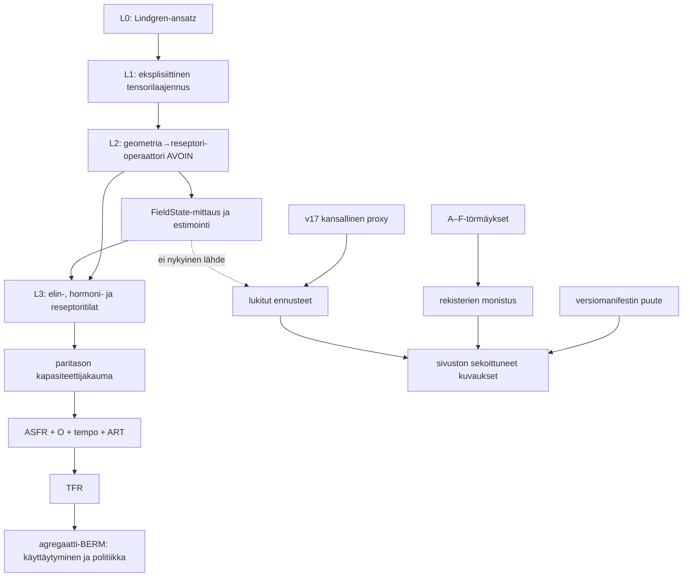

# BERM–FieldState-auditointi

Päivämäärä: 2026-09-02  
Auditoija: Codex  
Kohde: `extinctionfield.com`-repo ja `berm/`-Python-paketti  
Menetelmä: staattinen lähdekoodi-, datarekisteri- ja ajoreittiauditointi. Lähdetiedostoja ei muutettu.

## Yhteenveto

Auditissa löytyi 62 erillistä havaintoa: 28 kriittistä, 24 korjattavaa ja 10 tiedoksi kirjattavaa. Raakahaku tuotti sivustosta 688 FieldState-osumariviä 40 tiedostossa. Osumarivi ei ole sama asia kuin virhe: suuri osa on käännöksiä, tunnisteita tai mittaussanastoa. Kriittinen ongelma on se, että käsitteellinen erottelu on jo paikoin kirjoitettu oikein, mutta tiedon lähteet ja laskennalliset reitit eivät noudata yhtä kanonia.

Kolme tärkeintä löydöstä:

1. **Lindgrenistä biologiaan johtava kytkentäoperaattori puuttuu.** Python toteuttaa L0-premissin rinnalle BERM:n omat χ-, vektori- ja pistetulovalinnat, mutta ei johda niitä tensoritasolta reseptori-, SHBG-, androgeenireseptori- tai reseptorinjälkeiseksi vasteeksi. Sivusto väittää silti ketjun olevan täydellisesti johdettu.
2. **Julkaistut maakohtaiset ennusteet eivät tule mittaustietoisesta reitistä.** Ne ovat v17:n kansalliseen kumulatiiviseen teknologia-altistusproxyyn perustuvia lukkoja. `berm-v19`/FieldState–ASFR-reitti ottaa valmiit biologiset paritilat ulkoisina syötteinä eikä tällä hetkellä tuota maakohtaisia ennusteita.
3. **Yhtä kanonista mallia, versiota, evidenssirekisteriä tai solmuontologiaa ei ole.** Pythonissa on vähintään neljä rinnakkaista laskentareittiä; verkkosivulla elävät v17, v19.1, v20/v21 ja “FieldState v2”; Pythonin, TypeScriptin ja JSON:n rekisterit eroavat toisistaan.

Auditin tulkintaportti:

- BERM on selitys-, johto- ja ennustemalli.
- FieldState on BERM:n mittaus-/havainto-/estimointiosio, ei mallin synonyymi eikä kausaalinen alkusyy.
- Lindgren 2025 antaa auditoidussa repossa L0-premissin `g_μν = η_μν + A_μA_ν`. Kun `A=A_bio+a_ext`, L1-ristitermi on `δg_μν=A_bio,μa_ν+a_μA_bio,ν+a_μa_ν`.
- χ-laki, skalaari `ambient + χ(ambient)·personal`, 3-vektorin pistetulo ja biologiset vastefunktiot ovat BERM:n sulkeumia/ehdotuksia, ellei niiden erillistä johtoa esitetä. Niitä ei tule nimetä Lindgrenistä johdetuiksi vain siksi, että ne ovat yhteensopivia neliöllisen ristirakenteen kanssa.

## A. Terminologian kartoitus

### A.1 FieldState-esiintymät (688 osumariviä)

Raakaluku on case-insensitive-riviosumien määrä; samalla rivillä voi olla useita token-osumia. Alla oleva indeksi kattaa kaikki osumarivit. `MITTAUS` tarkoittaa paikallista kenttätilaa/protokollaa, `ARKKITEHTUURI` FieldState-nimistä mallireittiä tai versiota, `MALLI` BERM:n korvaamista FieldStatella ja `EPÄSELVÄ` tunnistetta, komponenttinimeä, reittiä tai kontekstia, jota ei voi luokitella pelkän rivin perusteella.

| Tiedosto | N | Rivien pääluokka | Kaikki osumarivit |
|---|---:|---|---|
| `website/app/layout.tsx` | 1 | MITTAUS | 37 |
| `website/app/sitemap.ts` | 1 | ARKKITEHTUURI | 31 |
| `website/app/[locale]/page.tsx` | 1 | MITTAUS/MALLI | 60 |
| `website/app/[locale]/evidence/page.tsx` | 33 | sekoitettu | 52, 53, 54, 68, 80, 81, 86, 90, 91, 116, 407, 408, 413, 417, 418, 452, 735, 741, 745, 746, 780, 1031, 1037, 1041, 1042, 1076, 1327, 1333, 1337, 1338, 1372, 2851, 2857 |
| `website/app/[locale]/explorer/page.tsx` | 5 | EPÄSELVÄ/MITTAUS | 15, 25, 35, 45, 55 |
| `website/app/[locale]/about/page.tsx` | 16 | sekoitettu | 43, 44, 51, 76, 110, 117, 142, 176, 183, 208, 242, 249, 274, 308, 315, 340 |
| `website/app/[locale]/objections/page.tsx` | 8 | MITTAUS/EPÄSELVÄ | 159, 214, 428, 483, 697, 752, 1020, 1288 |
| `website/app/[locale]/sentinel/page.tsx` | 15 | sekoitettu | 149, 152, 153, 286, 289, 290, 415, 418, 419, 544, 547, 548, 673, 676, 677 |
| `website/app/[locale]/model/page.tsx` | 7 | sekoitettu | 31, 155, 951, 1075, 1871, 2742, 3613 |
| `website/app/[locale]/replication/page.tsx` | 35 | sekoitettu | 18, 22, 23, 48, 50, 58, 64, 67, 71, 72, 97, 99, 107, 113, 116, 120, 121, 146, 148, 156, 162, 165, 169, 170, 195, 197, 205, 211, 214, 218, 219, 244, 246, 254, 260 |
| `website/app/[locale]/ecology/page.tsx` | 10 | MITTAUS/EPÄSELVÄ | 11, 13, 18, 20, 25, 27, 32, 34, 39, 41 |
| `website/app/[locale]/data/page.tsx` | 62 | sekoitettu | 3, 13, 17, 22, 26, 31, 42, 46, 51, 55, 60, 71, 75, 80, 84, 89, 100, 104, 109, 113, 118, 129, 133, 138, 142, 147, 159, 163, 166, 179, 205, 209, 212, 225, 251, 255, 258, 271, 297, 301, 304, 317, 343, 347, 350, 363, 530, 544, 558, 602, 616, 630, 674, 688, 702, 746, 760, 774, 818, 832, 846, 907 |
| `website/app/[locale]/predictions/page.tsx` | 10 | MITTAUS/EPÄSELVÄ | 25, 26, 1856, 1857, 3687, 3688, 5469, 5470, 7251, 7252 |
| `website/app/[locale]/model/math/page.tsx` | 7 | sekoitettu | 15, 30, 44, 58, 72, 86, 120 |
| `website/app/[locale]/model/fieldstate/page.tsx` | 57 | sekoitettu | 15, 16, 38, 42, 43, 45, 46, 47, 49, 53, 74, 77, 80, 83, 87, 88, 90, 91, 92, 94, 98, 119, 122, 125, 128, 132, 135, 136, 138, 142, 163, 166, 169, 172, 176, 179, 180, 182, 186, 207, 210, 213, 216, 220, 223, 224, 226, 230, 251, 254, 257, 271, 286, 294, 295, 297, 354 |
| `website/app/[locale]/model/fieldstate/math/page.tsx` | 75 | sekoitettu | 27, 41, 56, 63, 64, 67, 75, 79, 113, 128, 135, 141, 152, 153, 180, 182, 194, 209, 216, 217, 220, 228, 232, 266, 281, 288, 294, 305, 306, 333, 335, 347, 362, 369, 370, 373, 381, 385, 419, 434, 441, 447, 458, 459, 486, 499, 514, 521, 522, 525, 533, 537, 571, 586, 593, 599, 610, 611, 639, 651, 666, 673, 674, 677, 685, 689, 723, 738, 745, 751, 762, 763, 790, 823, 838 |
| `website/app/[locale]/about/measurement/page.tsx` | 31 | sekoitettu | 23, 25, 39, 61, 67, 68, 74, 77, 93, 115, 121, 122, 128, 131, 147, 169, 175, 176, 182, 185, 201, 223, 229, 230, 236, 239, 255, 277, 283, 284, 290 |
| `website/app/[locale]/about/history/page.tsx` | 10 | sekoitettu | 15, 17, 29, 31, 43, 45, 57, 59, 71, 73 |
| `website/components/VarroaCascade.tsx` | 8 | EPÄSELVÄ | 17, 47, 77, 107, 137, 204, 207, 212 |
| `website/components/HindcastValidation.tsx` | 10 | MITTAUS/EPÄSELVÄ | 12, 17, 25, 30, 38, 43, 51, 56, 64, 69 |
| `website/components/EcoStaticInterface.tsx` | 80 | sekoitettu | 116, 152, 158, 166, 172, 207, 208, 232, 309, 311, 313, 315, 338, 348, 395, 396, 407, 443, 449, 457, 463, 498, 499, 523, 600, 602, 604, 606, 629, 639, 686, 687, 698, 734, 740, 748, 754, 789, 790, 814, 891, 893, 895, 897, 920, 930, 977, 978, 989, 1025, 1031, 1039, 1045, 1080, 1081, 1105, 1182, 1184, 1186, 1188, 1211, 1221, 1268, 1269, 1280, 1316, 1322, 1330, 1336, 1371, 1372, 1396, 1473, 1475, 1477, 1479, 1502, 1512, 1559, 1560 |
| `website/components/FieldStateStatus.tsx` | 49 | sekoitettu | 2, 5, 42, 48, 57, 62, 90, 95, 96, 103, 104, 121, 130, 135, 163, 168, 169, 176, 177, 194, 203, 208, 236, 241, 242, 249, 250, 267, 276, 281, 309, 314, 315, 322, 323, 340, 349, 354, 382, 387, 388, 395, 396, 419, 421, 432, 433, 449, 450 |
| `website/components/ModelTableOfContents.tsx` | 10 | EPÄSELVÄ | 33, 54, 79, 100, 125, 146, 171, 192, 217, 238 |
| `website/components/CausalChain.tsx` | 5 | EPÄSELVÄ | 29, 41, 53, 65, 77 |
| `website/components/GlobalDataExplorer.tsx` | 5 | EPÄSELVÄ/MITTAUS | 22, 55, 88, 121, 154 |
| `website/components/GlobalDataDownloads.tsx` | 5 | EPÄSELVÄ/MITTAUS | 8, 19, 30, 41, 52 |
| `website/components/EcoCausalVisuals.tsx` | 32 | sekoitettu | 43, 51, 60, 85, 86, 103, 111, 119, 128, 153, 154, 171, 179, 187, 196, 221, 222, 239, 247, 255, 264, 289, 290, 307, 315, 323, 332, 357, 358, 375, 430, 433 |
| `website/components/StatisticalValidation.tsx` | 2 | MITTAUS | 14, 25 |
| `website/components/CausalChainDiagram.tsx` | 3 | MITTAUS/EPÄSELVÄ | 6, 24, 282 |
| `website/components/DataSourcesContent.tsx` | 11 | sekoitettu | 2, 11, 14, 15, 22, 25, 26, 38, 47, 51, 58 |
| `website/components/DifferentialSusceptibility.tsx` | 5 | MITTAUS/EPÄSELVÄ | 18, 41, 64, 87, 110 |
| `website/components/WorldMap.tsx` | 6 | MITTAUS/EPÄSELVÄ | 18, 133, 143, 153, 163, 173 |
| `website/components/EcoTickHero.tsx` | 1 | EPÄSELVÄ | 222 |
| `website/components/ExplorerDashboard.tsx` | 2 | EPÄSELVÄ | 12, 24 |
| `website/components/ASFRCohortPhase.tsx` | 6 | MITTAUS/EPÄSELVÄ | 9, 11, 12, 17, 19, 20 |
| `website/components/GlobalValidation.tsx` | 10 | sekoitettu | 25, 27, 38, 40, 51, 53, 64, 66, 77, 79 |
| `website/lib/evidence.ts` | 37 | sekoitettu | 4, 15, 23, 25, 35, 37, 70, 80, 82, 96, 112, 128, 144, 178, 192, 226, 240, 400, 416, 420, 432, 448, 462, 466, 514, 560, 576, 592, 617, 679, 683, 687, 688, 689, 691, 821, 822 |
| `website/lib/causalChainV2Data.ts` | 14 | MITTAUS/EPÄSELVÄ | 13, 15, 18, 20, 56, 252, 259, 276, 277, 281, 290, 346, 351, 369 |
| `website/lib/causalMapData.ts` | 1 | MALLI/ARKKITEHTUURI | 400 |
| `website/lib/__tests__/evidence-registry.test.ts` | 2 | EPÄSELVÄ | 6, 22 |

Taulukon rivikohtaiset luettelot ovat kanoninen auditointi-indeksi; 688 on deduplikoitujen tiedosto+rivi-osumien määrä. Haku kattaa kirjoitusasut `FieldState`, `field-state` ja `FIELD_STATE`. Pääluokka on tiedostotason tiivistys; alla ovat semanttisesti ratkaisevat yksittäiset löydökset.

| ID | Tiedosto:rivi | Konteksti | Käyttö | Ongelma | Vaikutus |
|---|---|---|---|---|---|
| A-01 | `website/app/[locale]/model/page.tsx:31,951` | BERM = kausaaliteoria; FieldState = mittausspesifikaatio | MITTAUS | Oikea erottelu ja tavoitetila. | Tiedoksi |
| A-02 | `website/app/[locale]/model/fieldstate/page.tsx:38–45,83–90` | “FieldState measurement specification” | MITTAUS | Sisältö rajaa termin oikein, mutta URL ja oma sivuhierarkia saavat sen näyttämään rinnakkaiselta mallilta. | Korjattava |
| A-03 | `website/app/[locale]/model/fieldstate/page.tsx:46,91` | “FieldState replaces a national exposure scalar” | ARKKITEHTUURI | Mittaus korvaa proxysyötteen, ei BERM-mallia; otsikko on tulkittavissa liian laajasti. | Korjattava |
| A-04 | `website/app/[locale]/model/fieldstate/page.tsx:65,110` | “REGISTERED MODEL ARCHITECTURE” | ARKKITEHTUURI | Mittausspesifikaation sisällä oleva graafi nimetään omaksi malliarkkitehtuuriksi. | Kriittinen |
| A-05 | `website/components/EcoStaticInterface.tsx:395–396` | “FieldState measurement protocol” / “Open the FieldState model” | MITTAUS + MALLI | Vierekkäiset linkit käyttävät samaa termiä sekä protokollasta että mallista. | Kriittinen |
| A-06 | `website/data/claims.json:9–13,101–105,2324–2325` | “FieldState activates/modulates/reduces” | MALLI | Mittaustietue asetetaan kausaaliseksi toimijaksi. Toimijan pitäisi olla BERM:n fysikaalinen altistustila, jonka FieldState estimoi. | Kriittinen |
| A-07 | `website/data/causal-graph.json:5–27,29–68` | proxy on FIELDSTATE_VECTOR/ENVELOPE-solmujen vanhempi | MALLI | Kansallinen proxy on asetettu mitatun vektori-/spektritilan kausaaliseksi yläsolmuksi; representaatiohierarkia on nurin. | Kriittinen |
| A-08 | `berm/berm/model_fieldstate_asfr.py:159–170` | `active_chain: FieldState -> organ...` | MALLI | Julkinen tulos nimeää mittauksen ketjun alkusyyksi, vaikka funktio ei ota FieldStatea syötteenä. | Kriittinen |
| A-09 | `website/app/[locale]/model/fieldstate/page.tsx:131,175,219`; `.../math/page.tsx:487,637,791` | `versionNote: ""` | EPÄSELVÄ | EN/FI selittävät v17–v2-erottelun, JA/FR/KO jättävät kriittisen versionoterajauksen tyhjäksi. | Korjattava |

### A.2 Versioviittaukset

| Viite | Osumarivejä / tiedostoja | Missä merkityksessä | Ristiriita |
|---|---:|---|---|
| v17 | 206 / 31 | julkinen ennustemalli, kausaaligraafi, footer, evidenssi, matematiikka | Sama label kattaa sekä vanhan community-sigmoid-ajon että myöhemmän poikkileikkausdiagnostiikan tekstejä. |
| v18 | 5 / 1 | `v18_mitochondrial_ros_amplifier()`-funktion nimi viidessä käännöksessä | Ei sivuston kokonaismalliversio, mutta näyttää sellaiselta ilman namespacea. |
| v19 / v19.1 | 84 / 3 | Python-paketti, kolmikanavadiagnostiikka, falsifikaatiotestit | V19 on yhtä aikaa pakettijulkaisu ja diagnostiikkaperhe; sivusto sanoo ennustemallin olevan v17. |
| v2 | 90 / 19 | FieldState-mittausspesifikaatio sekä geneeriset V2-komponentit/tunnisteet | Pelkkä raakahaun “v2” ei ole yksi versiojärjestelmä. Semanttinen FieldState v2 keskittyy evidence- ja fieldstate-sivuille. |
| v20/v21 | useita model/mathematics-rivejä | ehdotettu kerroskaava ja tuleva kalibraatio | Lisää neljännen ja viidennen lukijan kohtaaman malliversion ilman yhteistä release-manifestia. |

| ID | Tiedosto:rivi | Nykytila | Ongelma | Vaikutus |
|---|---|---|---|---|
| A-10 | `berm/berm/__init__.py:1–11` | paketti v19/0.19.0, julkinen spesifikaatio v17, ASFR-export v18.0-asfr | Eri julkaisusyklit selitetään, mutta koneellista yhden totuuden manifestia ei ole. | Kriittinen |
| A-11 | `berm/berm/outcomes/fieldstate_asfr.py:1–4,37` | reitti “new, parallel berm-v19” | V19 tarkoittaa tässä mittaustietoista ASFR-reittiä, ei vain pakettiversiota tai diagnostiikkaa. | Kriittinen |
| A-12 | `website/app/[locale]/model/page.tsx:286,1206` | v19.1 = 54 maan diagnostiikka, v17 = ennuste | Rajaus on hyvä, mutta sama sivu esittää molemmat yhden “mallin” osina. | Korjattava |
| A-13 | `website/app/[locale]/mathematics/page.tsx:439,893` | v17 → v19.1 → v20 → v21 “formula evolution” | Antaa vaikutelman yhdestä peräkkäisestä mallista, vaikka ajoreitit ja validointistatukset eroavat. | Kriittinen |

### A.3 Python-terminologia

Raakahaku Pythonista: FieldState 817 osumariviä / 48 `.py`-tiedostoa, BERM 1 010 / 193, v17 228 / 28, v18 15 / 13 ja v19 66 / 17. Luvut sisältävät testit ja importit.

| ID | Tiedosto:rivi | Nykytila | Ongelma | Vaikutus |
|---|---|---|---|---|
| A-14 | `berm/berm/physics/field_state.py:1–18,365–387` | FieldState on eksplisiittinen paikallinen laskentatietue, ei biologinen annos | Oikea rajaus. | Tiedoksi |
| A-15 | `berm/berm/stats/fieldstate_core.py:1–13` | FieldState → elinmuisti nimetty “bridgeksi” | Dokumentaatio tunnistaa, että endpoint-mallin on annettava inkrementit; nimi tekee silti reitistä valmiimman kuin laskenta. | Korjattava |
| A-16 | `berm/berm/biology/causal_registry.py:1–14` | rekisterin nimi “FieldState ASFR route” | Kanonisen BERM-graafin nimi on sidottu mittausosioon. | Kriittinen |
| A-17 | `berm/berm/outcomes/fieldstate_asfr.py:1–20` | “FieldState biological route” | Demografinen BERM-reitti nimetään mittaustavan mukaan. | Korjattava |

## B. Evidenssin kaksikerroksisuus

### B.1 Rekisterit

| Tiedosto | Tietueita | Pakollinen rakenne | FieldState-sidos | Ongelma |
|---|---:|---|---|---|
| `website/lib/evidence.ts:25–40,70+` | 34 TS-tietuetta | kenttäluokka, järjestelmä, löydös, solmut, directness, scope, calibrationRole, limitations | “bounded” | Käsin ylläpidetty ja eroaa Pythonin 33 tietueesta. |
| `berm/data/evidence/fieldstate_causal_evidence.json` | 33 | yllä olevien lisäksi DOI/PMID, protokolla-arvio, diskriminaatio ja BERM-spesifisyys | bounded | Sisällöllisesti rikkain lähde, mutta ei generoi TS-rekisteriä. |
| `berm/data/evidence/fieldstate_evidence_constraints_v1.json` | 33 profiilia | konvergenssi, elinvaihe, elin, muisti/viive, prior-tier, heterogeenisyys, receptor_transfer | bounded constraint | Eri tiedosto samalle ID-joukolle; eheys riippuu erillisistä testeistä. |
| `website/lib/legacyEvidence.json` | 150 | id, viite, vuosi, polku, level, tagit, solmut, rooli, status, translationScope | legacy | 16 tietuetta enemmän kuin Python-migraatiossa. |
| `berm/data/evidence/legacy_reference_migration_v1.json` | 134 | legacy-luokitus, kanoniset solmut, rooli, status, lähdestatus, rajat, kalibrointirooli | legacy migration | Ei vastaa verkkokatalogia. |
| `berm/data/evidence/legacy_evidence_qualification_v1.json` | 21 | varmennetut tunnisteet, placement, source directness, constraint profile | legacy qualification | Vain pieni osajoukko migraatiorekisteristä. |
| `website/data/claims.json` | 28 claimia, 3 routea | väite, scope, riippuvuudet, evidenssirelaatiot, episteeminen arvio | kolmas järjestelmä | Neljä civilization-claimia eivät kuulu yhteenkään routeen. |

### B.2 Kriteerivertailu

Bounded-tietue ei ole vain eri formaatti. Se pakottaa kenttäluokan, järjestelmän, suoruutason, nimettyjen solmujen, siirtorajan, kalibrointiroolin ja rajoitteiden kirjaamisen. Legacy-tietue säilyttää lähinnä bibliografian, A–F-polun, vanhan evidence-levelin, tagit ja migraatiostatuksen. Sivusto kuvaa tämän oikein “eri rakenteeksi ja eri tiukkuudeksi” (`website/app/[locale]/evidence/page.tsx:89–97,416–424`). Kyse on siis kahdesta laatustandardista, ei vain kahdesta serialisoinnista.

| ID | Tiedosto:rivi | Nykytila | Ongelma | Vaikutus |
|---|---|---|---|---|
| B-01 | `website/app/[locale]/evidence/page.tsx:80–97,407–424` | Lukijalle kerrotaan kaksi rekisteriä ja eri tiukkuus | Oikea disclosure. | Tiedoksi |
| B-02 | `website/lib/evidence.ts:184–213`; Python JSON `:701+` | TS-only `CHAE_2019...` ja `ESHRE_2021...`; Python-only `NIKE_BBS_2026...` | “Bounded registry” ei ole sama data eri käyttöliittymässä. | Kriittinen |
| B-03 | `website/lib/legacyEvidence.json:169–185`; `berm/data/evidence/legacy_reference_migration_v1.json:387–413` | `sherrard2018`: TS `VERIFIED`, Python `UNVERIFIED_CITATION` | Sama lähde saa vastakkaisen hyväksyntästatuksen. | Kriittinen |
| B-04 | `website/lib/evidence.ts:25–40`; Python bounded JSON:n avaimet | TS pudottaa protokolla- ja diskriminaatiokentät | Selain ei voi näyttää kaikkea kanonisen arvioinnin tietoa. | Korjattava |
| B-05 | `website/data/claims.json:764–889,2268–2313,2316+` | 4 civilization-claimia, omat evidence assessmentit, ei routea | Sivilisaatiojohtopäätökset ovat irrallaan route-riippuvuusverkosta. | Korjattava |
| B-06 | `website/lib/evidence.ts:216–228` | De Iuliis käyttää SAR:ia mutta on bounded reproductive endpoint | Haku ei löytänyt sääntöä “SAR ei ole FieldState → hylkää”. Ongelma ei ole automaattinen SAR-poissulku vaan kahden rekisterin drift. | Korjattava |
| B-07 | `website/lib/legacyEvidence.json`; Python legacy migration | TS-only 19 ID:tä; Python-only `deiuliis2009`, `ritz2004`, `zandieh2025` | Migraation kattavuus ja nimikkeet eivät ole jäljitettävissä yhdestä manifestista. | Korjattava |

### B.3 Sivun käyttö ja SAR-raja

Evidence-sivu renderöi bounded-rekisterin suoruutasoittain (`page.tsx:2851–2895`) ja legacy-katalogin A–F-poluittain (`:2929–2975`). Ero näkyy lukijalle. SAR-tutkimuksia ei löydetyn koodin perusteella hylätä pelkästään siksi, etteivät ne mittaa FieldStatea: esimerkiksi De Iuliis on mukana bounded-rekisterissä, mutta sen scope rajaa sen pois väestöannoksen/TFR-kertoimen asemasta. Tämä on oikea tapa käsitellä endpoint-näyttöä. Varsinainen ongelma on kanonisen statuksen ja tietuemäärän eriytyminen.

## C. Ennusteiden ja mallikuvauksen irrallisuus

### C.1 Lukitut ennusteet

| Ennuste | Tiedosto:rivi | Malli/versio | Proksi |
|---|---|---|---|
| Suomi 2030 TFR 1,08 | `website/lib/predictions.ts:116–130` | v17.1 skalaari | device-adoption/cumulative exposure |
| Etelä-Korea 2030 TFR 0,61 | `:151–165` | v17.1 skalaari | sama |
| Etelä-Korea 2035 TFR 0,54 | `:186–200` | v17.1 skalaari | sama |
| USA 2030 TFR 1,35 | `:221–235` | v17.1 skalaari | sama |
| Japani 2030 TFR 1,01 | `:256–270` | v17.1 skalaari | sama |
| Brasilia 2030 TFR 1,44 | `:291–305` | v17.1 skalaari | sama |
| Globaali 2040 TFR 1,78 | `:326–340` | v17.0 skalaari | sama |
| Globaali 2050 sperm 62 % | `:353–367` | v17.0 skalaari | sama |
| Globaali 2040 poikaosuus 0,509 | `:380–394` | v17.1 mekanismiekstrapolaatio | ROS X/Y -herkkyys |
| Etelä-Korea 2040 feedback-TFR 0,39 | `:407–421` | v17.1 laajennus | cum-exposure + urbanisaatiopalaute |
| USA 2030 TFR-kiihtyminen −0,08/v | `:434–448` | CSLI-1 | lajienvälinen sentinel-viive |
| Faraday vs sinivalosuodatin +2,0 pistettä | `:462–476` | SLEEP-1 | interventiohypoteesi |

Pythonin `berm/berm/config.py:21–37` sisältää vain kahdeksan ensimmäistä lukkoa. TypeScript sisältää 12. Nämä eivät siis ole yksi generoitu ennusterekisteri.

### C.2–C.4 Mallikuvaus, matematiikka ja varoitukset

| ID | Sivun/reitin osa | Kuvaama malli | Tuottaako lukitut ennusteet? | Löydös | Vaikutus |
|---|---|---|---|---|---|
| C-01 | `berm/berm/model.py:110–156`; CLI `berm/berm/cli.py:15,30` | legacy v17 community sigmoid | CLI/export oletuksena kyllä | Tämä on nykyinen oletusajoreitti. | Kriittinen |
| C-02 | `berm/berm/model.py:128–139` | circadian/cohort/proximity lasketaan | Ei vaikuta `pred_tfr`:ään | Kolme raportoitua välitulosta ovat laskennallisesti kuolleita ennusteessa; IVF muuttaa vain jälkikäteen raportoitua `biological_tfr`:ää. | Kriittinen |
| C-03 | `berm/berm/model.py:34–53,82–85` | v4 `community_fit_function` ja v7 sigmoid rinnakkain | Ennuste käyttää v4-funktiota | Kommentoitu “recalibrated v7” ei ole käytetty ennustefunktio. | Kriittinen |
| C-04 | `berm/berm/v16.py:956–998` | dekomponoitu bio × behavior × culture | erillinen v16/v17-reitti | 2024 “culture” ratkaistaan jokaiselle maalle havainnosta ja tuleva kompensaatio sisältää biologisen termin käänteisen muutoksen; in-sample-fit ei ole riippumaton kulttuurikomponentti. | Kriittinen |
| C-05 | `berm/berm/model_fieldstate_asfr.py:74–146` | mittaustietoinen WPP/ASFR-fasadi | Ei ilman ulkoisia paritiloja | Funktio ei ota FieldStatea eikä rakenna paritiloja; nimi ja docstring antavat valmiimman ketjun vaikutelman. | Kriittinen |
| C-06 | `berm/berm/outcomes/fieldstate_asfr.py:81–112,125–157` | ASFR = base × bio × O × tempo × ART | Ehdollinen skenaario | O/tempo/ART ovat oletuksena 1,0; ainoa kalibraatiostatus riippuu paritiloista, ei demografisten syötteiden laadusta. | Korjattava |
| C-07 | `website/app/[locale]/predictions/page.tsx:19–26,43,1850–1857,1874` | v17 scalar proxy | kyllä | Varoitus kertoo mallin, proxyn, ei-probabilistisen välin ja sen, ettei FieldState-kalibroituja ennusteita ole. Tämä osa toimii. | Tiedoksi |
| C-08 | `website/app/[locale]/model/page.tsx:151–167,4862+` | kolmitasoinen v17 | väittää kuvaavansa lukkojen logiikkaa | Teksti sanoo TFR:n olevan tasojen tulo, mutta `model.py:136` laskee sigmoidin ja kulttuurin summan. | Kriittinen |
| C-09 | `website/app/[locale]/model/math/page.tsx:24–47` + `website/app/[locale]/mathematics/page.tsx:36–54` | v17 skalaari ja “complete derivation” | väittää kyllä | Geneerinen matematiikkasivu ei ole FieldState-ASFR v2; se sisältää lisäksi v19.1/v20/v21-diagnostiikat. | Korjattava |
| C-10 | `website/app/[locale]/model/fieldstate/math/page.tsx:179–180,332–333` | v2 mittaus → elin → pari → ASFR → TFR | sanoo oikein: ei | Oikea disclosure on vain EN/FI; JA/FR/KO `versionNote` on tyhjä. | Korjattava |

Lisäksi `berm/berm/outcomes/cohort_exposure.py:84–114` normalisoi kohortin arvoon, jossa `v16_adjusted_cumulative_exposure` sisältää jo ammattikertoimen (`berm/berm/v16.py:413–418`), ja kertoo ammattikertoimella uudelleen. Tämä vääristää kohorttiennusteiden altistusasteikkoa.

## D. Polkunimeäminen ja painot

### D.1 Kirjainten merkitykset

| Namespace / tiedosto | A | B | C | D | E | F |
|---|---|---|---|---|---|---|
| `berm/berm/biology/pathways.py:1–85` | VGIC/Ca/ROS | RPM/CRY | BBB/HPA | HPA/HPG | dysbioosi | BBB-kemikaalimultiplier |
| `berm/berm/v16.py` intervention catalogue, tulkinta `legacy_compat.py:111–127` | VGIC | — | melatoniini | HPA/HPG | — | Vmem/mTOR |
| `website/lib/causalMapData.ts:384–445,721–722` | VGCC/ROS | CRY/TRPC1 | BBB/BTB | ei yhtenäistä kattavaa käyttöä | — | — |
| `website/lib/causalChainData.ts:151–153,468–474,682–684` | vanha geometrinen/VGIC | CRY/RPM joissain kohdissa | muualla melatoniini | HPA/HPG | BBB eräissä teksteissä | — |
| Kanoninen Python `causal_registry.py` | semanttiset ID:t, ei paljaita kirjaimia | semanttiset ID:t | semanttiset ID:t | semanttiset ID:t | semanttiset ID:t | semanttiset ID:t |

| ID | Tiedosto:rivi | Nykytila | Ongelma | Vaikutus |
|---|---|---|---|---|
| D-01 | `berm/berm/biology/legacy_compat.py:1–10,82–127` | Namespace-qualified adapter tunnistaa C/F-törmäykset | Oikea rakenne; tätä ei ole pakotettu TS-puolella. | Tiedoksi |
| D-02 | `berm/berm/biology/pathways.py:1–46`; `berm/berm/v16.py:430–434` | A=.45, B=.25, C=.15, D=.15 | Painot täsmäävät näissä kahdessa Python-lähteessä. | Korjattava |
| D-03 | `website/app/[locale]/mathematics/page.tsx:412,866` | nested χ käyttää γA=.75, γB=.25 | Eri painojärjestelmä kuin Pythonin A=.45/B=.25/C=.15/D=.15; ei namespacea. | Kriittinen |
| D-04 | `website/app/[locale]/model/fieldstate/page.tsx:53–54,98–99` | A+D=60 % peak; B+C=40 % RMS | Sitoutuu legacy-painoihin mittausspesifikaatiossa ja tekee C:stä BBB:n; ei ole yleinen BERM-kanoninen reitti. | Kriittinen |
| D-05 | `website/lib/causalMapData.ts:721–722` | sekä BBB että BTB merkitty C:ksi | Python v17:n C on BBB, mutta BTB on erillinen semanttinen solmu; yhteinen C hävittää elinkohtaisen eron. | Korjattava |
| D-06 | `website/app/[locale]/model/page.tsx:171–175,1091–1093` | B PRIMARY, A kokeellisesti vahvin, D “derived” | PRIMARY/derived-status ei vastaa rekisterin kalibraatio- tai episteemisiä statuksia. | Kriittinen |
| D-07 | `website/lib/causalChainV2Data.ts:4–9` | legacy-kirjaimet luvataan pitää vain compatibility-bindingsissä | Sivuston muut tiedostot näyttävät edelleen paljaita kirjaimia, joten lupaus ei pidä repo-laajuisesti. | Korjattava |

### D.3 Lindgren-status

Eksplisiittistä yhdenmukaista `PRIMARY / SECONDARY / NOT_DERIVED` -rekisteriä ei löytynyt. `primary` on pääosin graafireunan UI-prioriteetti (`website/lib/types.ts:114`; `causalChainV2Data.ts:258–269`), kun taas model-sivu käyttää “PRIMARY” teoreettisena derivointistatuksena. `NOT_DERIVED` puuttuu niistä kohdista, joissa sitä eniten tarvittaisiin.

Nykyisen johtotason mukaan:

- L0 Lindgren-ansatz: lähdepremissi.
- L1 eksplisiittinen ristiterlaajennus: johdettavissa.
- χ, `ambient + χ·personal`, 3-vektoripistetulo: BERM-sulkeumia, eivät tässä repossa Lindgrenistä johdettuja.
- reseptori-, elin-, hormoni-, käyttäytymis- ja TFR-operaattorit: BERM-siltoja; niiden parametritaso on ilmoitettava erikseen.

## E. Python–TypeScript-synkronointi

### E.1 Solmurekisteri

Pythonissa on 35 semanttista solmua (`berm/berm/biology/causal_registry.py:49–462`). `causalChainV2Data.ts` sisältää 10 karkeaa UI-solmua ja `causalMapData.ts` 76 atlas-solmua. Yksikään ei käytä suoraan samaa ID-avaruutta.

| Python-id (rivi) | `causalChainV2Data.ts` | `causalMapData.ts` | Vastaavuus |
|---|---|---|---|
| FIELDSTATE_SELECTED_PROXY (51) | fieldstate | electrification_boundary / mod_geometry | eri; proxy ja mittaus sulautuvat |
| FIELDSTATE_VECTOR (69) | fieldstate | ch_rf / mod_geometry | osittainen |
| FIELDSTATE_ENVELOPE (79) | fieldstate | ch_elf / ch_if / ch_rf | osittainen |
| STATIC_TRIBO_INTERFACE (89) | fieldstate | ch_static / mech_skin_bioelectric | osittainen |
| FIELDSTATE_LOW_FREQUENCY_ELECTRIC (99) | fieldstate | ch_elf | osittainen |
| A_VGCC_ROS (109) | mechanisms | mech_vgcc_ros / mech_mitochondrial_ros | osittainen |
| B_RPM_CRY (134) | mechanisms | mech_cry_melatonin / mech_trpc1_calcium | osittainen |
| MELATONIN_REDOX (144) | mechanisms | tissue_melatonin / mech_melatonin_fertility | osittainen |
| VMEM_MTOR (161) | mechanisms | mod_bioelectric | osittainen, mTOR ei oma solmu |
| BIOELECTRIC_DEVELOPMENT (176) | mechanisms | mod_bioelectric | osittainen |
| HPA_HPG (186) | mechanisms | endo_pituitary_hub / tissue_cortisol/testosterone | osittainen |
| MICROBIOME_OT (206) | mechanisms | tissue_gut | osittainen, OT puuttuu |
| BARRIER_BBB (216) | other-barriers | tissue_bbb | sama merkitys, eri ID |
| BARRIER_BTB (226) | btb | tissue_btb | sama merkitys, eri ID |
| BARRIER_PLACENTA (236) | other-barriers | — | puuttuu atlas-ID:nä |
| BARRIER_RETINA (246) | other-barriers | — | puuttuu atlas-ID:nä |
| MALE_SPERM (256) | male | tissue_sperm / mech_catsper_nav | osittainen |
| MALE_GERMLINE_RESERVE (273) | male | — | puuttuu |
| MALE_STEROIDOGENESIS (283) | male | tissue_testosterone | osittainen |
| OVARIAN_RESERVE (293) | female | tissue_ovarian | osittainen |
| OOCYTE_REDOX (303) | female | tissue_ovarian | sulautettu |
| OVULATION_CLOCK (313) | female | tissue_ovarian | sulautettu |
| IMPLANTATION (329) | female | — | puuttuu |
| COUPLE_FECUNDABILITY (339) | couple | demo_biocap | eri aggregaatiotaso |
| IF_MITOTIC_DISRUPTION (350) | mechanisms | mech_mitotic_spindle / ch_if | osittainen |
| GPCR_ADENOSINE (360) | mechanisms | mech_gpcr | sama merkitys, eri ID |
| VAGUS_ANTIINFLAMMATORY (370) | mechanisms | mech_vagal_antiinflam | sama merkitys, eri ID |
| ECOLOGICAL_ENCOUNTER (380) | — | eco_* / ecosystem_cascade | osittainen |
| ECOLOGICAL_SELECTION (390) | — | ecosystem_cascade | sulautettu |
| ECOLOGICAL_TRAIT_STATE (400) | — | — | puuttuu |
| DEMAND_OPPORTUNITY (410) | demographic-inputs | demo_behavior | vain osittainen |
| TEMPO (420) | demographic-inputs | — | puuttuu |
| ART_LIVE_BIRTH_DELIVERY (430) | demographic-inputs | — | puuttuu |
| ASFR (440) | asfr | demo_asfr | sama merkitys, eri ID |
| TFR (455) | tfr | demo_tfr | sama merkitys, eri ID |

| ID | Tiedosto:rivi | Nykytila | Ongelma | Vaikutus |
|---|---|---|---|---|
| E-01 | `causal_registry.py:49–462` vs `causalChainV2Data.ts:11–256` vs `causalMapData.ts:70–804` | 35 / 10 / 76 ID:tä | Ei koneellista 1:1- tai 1:n-moneen mapping-manifestia. | Kriittinen |
| E-02 | `website/data/causal-graph.json:5–27` | JSON käyttää Python-ID:tä mutta eri kenttäarvoja | Aiempi auditointi löysi myös kalibraatiostatusten driftin; tiedosto ei ole generoitu Pythonista. | Kriittinen |
| E-03 | `berm/berm/exposure/lindgren.py:1–30`; `physics/field_state.py:478–550` | χ ja valittu vektori toteutettu | Koodi nimeää χ:n Lindgren-valintasäännöksi ilman johtoa L0/L1:stä. | Kriittinen |
| E-04 | `physics/field_state.py:504–506,534` | `2·background.dot(personal)` | Tämä on valittu euklidinen 3-vektorikontraktio, ei dokumentoitu nelivektori/tensorikontraktio L1:stä. | Kriittinen |
| E-05 | `stats/fieldstate_core.py:154–161,228–265` | inkrementti annetaan ulkoa | FieldState-features lasketaan, mutta inkrementti ei riipu niistä; keskeinen fysikka→biologia-operaattori puuttuu. | Kriittinen |
| E-06 | `biology/reproductive_state.py:95–151,197–242,329+` | R/P-muisti, elinkohtaiset kapasiteetit, BTB erillinen, pari aggregoidaan | Hyvä rakenne, mutta SHBG/free hormone/AR/post-receptor -tilat eivät ole eksplisiittisiä solmuja tai operaattoreita. | Korjattava |
| E-07 | `berm/berm/export.py:71–82` | export sanoo oikein cum_emf:n olevan proxy, ei FieldState | Oikea disclosure; muu sivusto ei aina säilytä sitä. | Tiedoksi |
| E-08 | `berm/export_asfr.py:30,59` | v18.0-asfr export käyttää `cumEMF`-kenttää | Export-version ja julkisen malliversion eri tarkoitus on vain kommentissa. | Korjattava |
| E-09 | `berm/berm/exposure/personal.py:76–110` | TECH_DIFFUSION luetaan ja rate lasketaan, sitten korvataan kovakoodilla | Kanoniselta näyttävä dataohjattu syöte on kuollut. | Korjattava |

### E.2 Versiolabelit

Python käyttää rinnakkain semveriä (`0.19.0`), julkista mallilabelia (`v17`), reittilabelia (`berm-v19`), export-labelia (`v18.0-asfr`), diagnostiikkalabelia (`v19.1`) ja skeemaversioita. TypeScript käyttää enimmäkseen v17/v19.1/v2-tekstileimoja eikä tuo niitä Pythonin manifestista. Järjestelmät eivät siis käytä samaa versiologiikkaa, vaikka yksittäiset sivut yrittävät selittää eroa.

## F. Sivuston navigaatio ja lukijakokemus

### F.1 Lukijan polku

| Vaihe | Mitä lukija näkee | Hämmennyskohta | Vaikutus |
|---|---|---|---|
| Etusivu | BERM-tutkimusmalli (`page.tsx:58–79,106–127`) | Väittää 56/56 mekanistista vaihetta todennetuksi ja “one mechanism”, vaikka keskussilta on avoin ja haaroja on useita. | Kriittinen |
| Etusivu → sivilisaatio | BERM:n biologinen rapautuminen selittää yhteiskuntasyklejä (`:84–86,132–134`) | Aggregaattihormoni→politiikka-operaattori ei kuulu kanoniseen 35 solmun graafiin. | Kriittinen |
| Model | BERM kausaaliteoriana; v17-, v19.1-, v20/v21-, FieldState- ja civilization-osat | Sivun alku tekee oikean erottelun, mutta myöhempi “complete chain” kumoaa varovaisuuden. | Korjattava |
| Model → Mathematics | Navigaatio lupaa “Complete derivation from Lindgren geometry to TFR” (`navigation.ts:143–151`) | Johtoketju ei ole täydellinen; linkki vie skalaarisivulle, ei mittaustietoiseen v2-sivuun. | Kriittinen |
| Model → FieldState | Otsikko “FieldState measurement specification” | Oikea sisältö, mutta oma `/model/fieldstate`-haara ja “model architecture” tekevät siitä rinnakkaismallin. | Korjattava |
| Predictions | Selkeä v17 proxy disclosure | Toimii 12 TS-lukolle, mutta Pythonin canonical lock -lista sisältää vain 8. | Korjattava |
| Evidence | Kaksi rekisteriä näkyvästi eroteltu | Disclosure toimii, mutta lukija ei näe rekisterien keskinäistä data-/statusdriftiä. | Korjattava |

### F.2 Navigaatioterminologia

Päänavigaatio käyttää oikein “Model / Malli” (`website/lib/navigation.ts:53–55`) eikä nimeä koko mallia FieldStateksi. Footer käyttää “BERM v17 · Bio-Electromagnetic Reproductive Model” (`website/components/SiteFooter.tsx:14–42`). Tämä on toimiva tavoitetila.

Ongelma on alavalikon lupaus “Complete derivation from Lindgren geometry to TFR” (`navigation.ts:143–151`) sekä FieldState-sivun löytyminen vain model-sivun tekstilinkeistä, ei selvästi nimettynä “Measurement” omassa navigaatioluokassaan.

### F.3 `model/fieldstate`-alasivun asema

| ID | Tiedosto:rivi | Havainto | Luokitus | Vaikutus |
|---|---|---|---|---|
| F-01 | `model/fieldstate/page.tsx:38–45,83–90` | Otsikko ja ingressi sanovat mittausspesifikaatioksi | MITTAUS, oikein | Tiedoksi |
| F-02 | `:62–65,107–110` | Samalla sivulla “Registered model architecture” | ARKKITEHTUURI | Kriittinen |
| F-03 | `:77–80,122–125` | “FieldState mathematics” ja next-title | ARKKITEHTUURI | Korjattava |
| F-04 | `model/fieldstate/math/page.tsx:34–38,187–191` | Meta sanoo “BERM v17 mathematical specification: measurement-aware route” | MALLI/EPÄSELVÄ | BERM v17 ja v2-reitti sekoittuvat metadataan. | Kriittinen |
| F-05 | `model/math/page.tsx:24–33,38–47` | toinen BERM-matematiikkasivu kuvaa scalar-arkkitehtuurin | MALLI | Kaksi “mathematical specification” -sivua, eri reitit. | Korjattava |
| F-06 | `navigation.ts:46–154`; `SiteFooter.tsx:14–42` | päänavigaatio/footer käyttää BERM:iä | MALLI, oikein | Tiedoksi |
| F-07 | `model/fieldstate/page.tsx:131,175,219` | vain EN/FI sisältää versionoten | EPÄSELVÄ | Kolmen käännöksen lukija ei saa tärkeintä rajauslausetta. | Korjattava |

## G. Ekologiasivun referenssitoteutus

Ekologiasivu toteuttaa monta tavoiteperiaatetta hyvin: se erottaa staattisen, ELF-, geomagneettisen ja RF-luokan, vaatii paikallisen mittauksen, pitää laji- ja elinvaihekohtaiset siirtofunktiot erillisinä ja erottaa mitatun vasteen ekologisesta lajittumisesta sekä periytyvästä evoluutiosta.

| ID | Tiedosto:rivi | Käyttö | Miksi oikein / ongelma | Vaikutus |
|---|---|---|---|---|
| G-01 | `website/app/[locale]/ecology/page.tsx:11–20` | MITTAUS | BERM–Eco on mallin nimi; FieldState viittaa eroteltuihin kenttäluokkiin. | Tiedoksi |
| G-02 | `EcoStaticInterface.tsx:116–142` | MITTAUS | “measured field configuration”, erilliset DC/ELF/geomagnetic/RF-suureet. | Tiedoksi |
| G-03 | `EcoStaticInterface.tsx:145–173` | MITTAUS/MALLI | Luonnollinen funktio → mitattu vaste → lajittuminen → evoluutio erotetaan, mutta “changed FieldState can alter” personifioi mittaustietueen. | Korjattava |
| G-04 | `EcoStaticInterface.tsx:309–315`; `EcoCausalVisuals.tsx:43–60` | MITTAUS lyhenteenä | `W(FieldState, ...)` ja `R_i=H_i(FieldState)` ovat käyttökelpoisia mittauskoordinaatteina vain, jos teksti sanoo vasteen kohdistuvan fysikaaliseen tilaan, ei tietueeseen. | Korjattava |
| G-05 | `EcoStaticInterface.tsx:395–396` | MITTAUS + MALLI | “measurement protocol” ja “FieldState model” rinnakkain on auditin selkein terminologinen ristiriita. | Kriittinen |

Ekologiasivu ei siis ole täysin valmis referenssi. Sen **rakenteellinen** malli on paras sivustolla, mutta kaksi sanavalintaa rikkovat BERM → FieldState -hierarkian. Tavoitemuoto olisi: BERM–Eco johtaa vastehypoteesin; FieldState-tietue estimoi paikallisen fysikaalisen syötteen; lajikohtainen operaattori muuntaa sen biologiseksi vasteeksi.

## Mallilogiikan erityisauditointi: Lindgren → BERM → FieldState → biologia

Tämä osio kokoaa löydökset, jotka ratkaisevat BERM–FieldState-erottelun syyn.

| Taso | Repossa | Status | Puuttuva / ylitetty askel |
|---|---|---|---|
| L0 | `model/page.tsx:958`; `berm/berm/exposure/lindgren.py:1` | lähdepremissi | `g=η+AA` |
| L1 | sivusto käsittelee neliöllisyyttä, mutta ei pidä eksplisiittistä tensorilaajennusta kanonisena artefaktina | johdettavissa | `A=A_bio+a_ext` → ristitermeille indeksoitu johto |
| L2 | `physics/field_state.py:504–550` | BERM-sulkeuma | Minkä kontraktion, yksiköiden ja fysikaalisen objektin kautta L1 tuottaa 3-vektorin, χ:n, organ transferin tai PSD-painon? |
| L3 | `stats/fieldstate_core.py:154–265`; `biology/reproductive_state.py:95–242` | rakenne on olemassa, parametrit ulkoisia | FieldState-features → receptor state → R/P-increment; SHBG/free hormone/AR/post-receptor-operaattorit |
| L4 | `outcomes/fieldstate_asfr.py:66–228` | ehdollinen ASFR-laskenta | paritilojen populaatiojakauma sekä O/tempo/ART:n mitattu provenance ja validointi |

Sivuston väitteet, jotka ylittävät tämän statusketjun:

- `website/app/[locale]/model/page.tsx:171–173,1091–1093`: 87,5 % RPM-Hamiltoniaanista johdettu ja B PRIMARY. Reposta ei löydy tätä laskua; `docs/audit/SITE_MODEL_DRIFT_2026-09-02.md:155` toteaa väitteen olevan käsin ylläpidetty ilman Python-/docs-lähdettä.
- `website/app/[locale]/model/page.tsx:960–963`: χ on metrisen ansatzin rakenteellinen seuraus ja kaava `Ā/(Ā+K)`.
- `website/app/[locale]/model/page.tsx:5141–5143`; `berm/berm/exposure/lindgren.py:15–18`: käytetty kaava on `Ā/sqrt(1+Ā²)`. Kyse ei ole samasta funktiosta.
- `website/app/[locale]/mathematics/page.tsx:36–54,1975–2045`: “Every equation is derivable from the previous one”, vaikka χ:n johto ja geometria→reseptorioperaattori puuttuvat.

## Vaikutusanalyysi

| Kategoria | Löydöksiä | Kriittisiä | Korjattavia | Tiedoksi |
|---|---:|---:|---:|---:|
| A. Terminologia ja versiot | 17 | 9 | 6 | 2 |
| B. Evidenssi | 7 | 2 | 4 | 1 |
| C. Ennusteet | 10 | 6 | 3 | 1 |
| D. Polut | 7 | 3 | 3 | 1 |
| E. Synkronointi | 9 | 5 | 3 | 1 |
| F. Lukijakokemus | 7 | 2 | 3 | 2 |
| G. Referenssi | 5 | 1 | 2 | 2 |
| **Yhteensä** | **62** | **28** | **24** | **10** |

Huomautus: osio A:n vaikutusluvut sisältävät A.1–A.3:n ID:t A-01…A-17. Yhteenvetoluku 62 on kaikkien eksplisiittisesti ID-merkittyjen A–G-rivien summa; mallilogiikan taulukko tarkentaa samoja juurilöydöksiä eikä sitä lasketa uudelleen. Se ei laske 688 raakaosumariviä erillisiksi ongelmiksi.

## Riippuvuusverkko

### Korjausjärjestys myöhempää sessiota varten

1. **Määritä yksi BERM-kausaalikanoni ja johtotasot.** Kirjaa L0/L1, nimeä L2 avoimeksi ja estä χ:n/biologiasillan kutsuminen Lindgrenistä johdetuksi ilman operaattoria.
2. **Luo koneellinen release-/route-manifesti.** Erota pakettiversio, ennustereitti, diagnostiikka, mittausskeema ja export-versio.
3. **Nimeä Pythonin 35 semanttista ID:tä kanonisiksi.** Generoi `causal-graph.json`, TS-mapping ja UI-ryhmät samasta lähteestä; säilytä atlas-ID:t näkymäkohtaisina aliaksina.
4. **Yhdistä evidenssin lähde.** Pythonin bounded + constraint + legacy qualification muodostavat kanonin; generoi TS-katalogi ja julkaise drift-testi.
5. **Erota laskentareitit käyttöliittymässä.** v17-lukot, v19.1-diagnostiikka ja mittaustietoinen ehdollinen ASFR-reitti eivät saa näyttää yhden ajon eri sivuilta.
6. **Korjaa polkukirjaimet viimeiseksi tai poista ne julkisesta kanonista.** Ensin semanttiset solmut, sitten namespace-qualified legacy-aliaset.
7. **Päivitä lukijapolku ja käännökset.** Navigaatio voi käyttää BERM:iä; FieldState sijoitetaan nimellä “mittausspesifikaatio BERM:n sisällä”.

### Juuri–seuraus-erottelu

- **Juurisyitä:** puuttuva L2-operaattori; monistettu kanoninen data; versionamespacejen puute; legacy-laskentareittien yhtäaikainen julkisuus.
- **Seurauksia:** FieldState-kausaalikieli, A–F-törmäykset, 8 vs 12 lukkoa, eri evidence-statukset, kaksi matematiikkasivua ja ristiriitainen “complete derivation”.
- **Ei itsenäisiä virheitä:** se, että paikallinen FieldState sisältää vektorin, spektrin, vaiheen, ajan ja provenance-tiedot; se, että bounded-tietue rajaa SAR-tutkimuksen translation scopen; se, että TFR johdetaan ASFR-summana.

## Auditoinnin rajat

- Tämä on repo-nykytilan auditointi, ei tieteellisen kirjallisuuden ulkoinen uudelleenarviointi.
- Rivinumerot viittaavat 2026-09-02 työpuun tilaan ja muuttuvat myöhemmissä korjauksissa.
- Työpuussa oli auditoinnin alkaessa käyttäjän keskeneräisiä muutoksia; niitä ei muokattu eikä palautettu.
- A.1:n 688 on hakutulosrivi-indeksi, ei 688 käsitteellistä väitettä eikä 688 virhettä.
